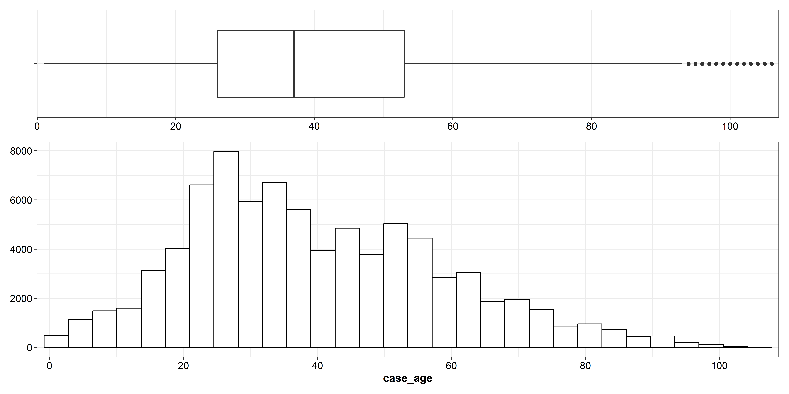
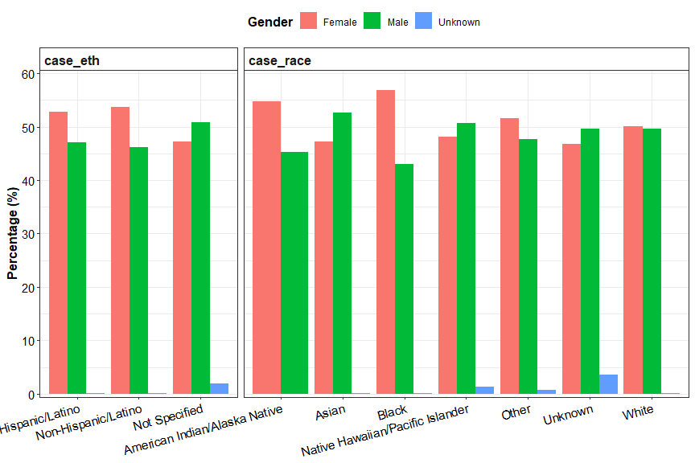
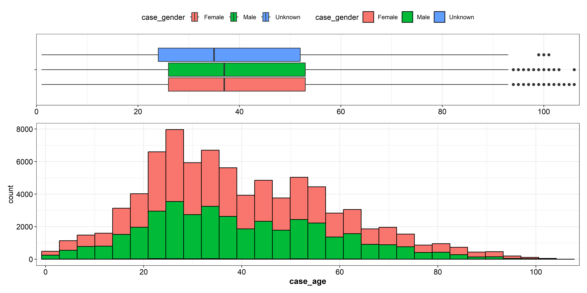
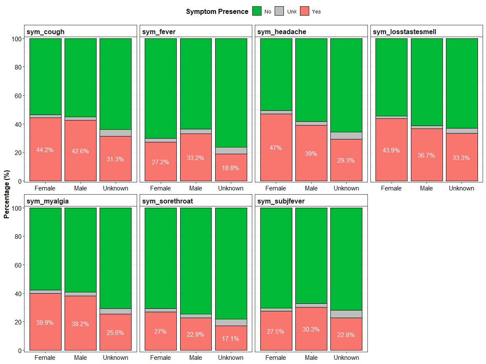
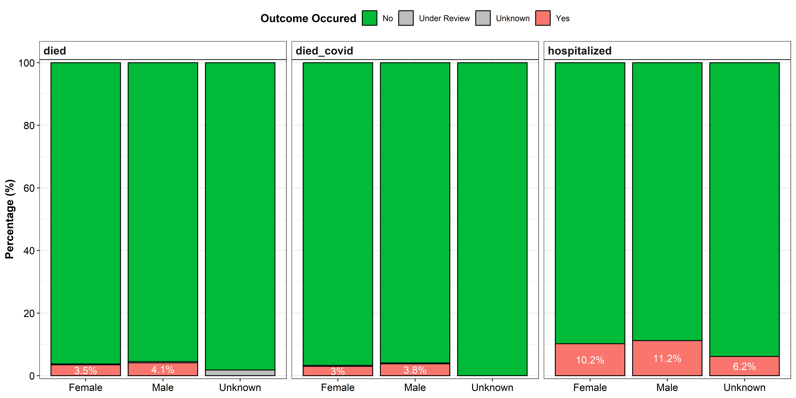

# COVID-19 Example Data
Juluis Visnel Foyet
2026-03-12

- [The dataset](#the-dataset)
- [Packages Importation](#packages-importation)
- [Data Importation](#data-importation)
- [Data Exploration](#data-exploration)
  - [Race and Ethnicity Formating](#race-and-ethnicity-formating)
  - [Missing values](#missing-values)
- [Demographics](#demographics)
  - [Gender](#gender)
  - [Race](#race)
  - [Ethnicity](#ethnicity)
  - [Age](#age)
  - [Demographics by gender](#demographics-by-gender)
- [Symptoms](#symptoms)
  - [Overall](#overall)
  - [By Gender](#by-gender)
- [Covid Outcome](#covid-outcome)
  - [By Gender](#by-gender-1)
- [Weekly trend of Outcomes](#weekly-trend-of-outcomes)
  - [Hospitalization](#hospitalization)
    - [n Cases](#n-cases)
    - [% of Hospitalization from n
      Cases](#-of-hospitalization-from-n-cases)
    - [n Deads](#n-deads)
    - [n Deads from Covid](#n-deads-from-covid)
- [Bamm!!](#bamm)

# The dataset

The dataset used in this project is an example Covid data of 82,101
observations and 31 variables relating to demographics, symptoms and
outcomes of Covid (Hospitalization and dead). It can be downloaded at
<https://github.com/appliedepi/epiRhandbook_eng/tree/master/data/covid_example_data>

# Packages Importation

``` r
library(readxl) # To import excel datasets
library(tidyverse) # Data wrangling and Viz
library(freqtables)
library(gt)
library(gtExtras)
library(patchwork)
```

# Data Importation

After importing the dataset, I use the `glimpse` function to have a feel
about the size and the variables. R seems to have accurately captured
the type of each variable.

``` r
df <- read_excel('covid_example_data.xlsx')

glimpse(df)
```

    Rows: 82,101
    Columns: 31
    $ PID                    <chr> "3a85e6992a5ac52f", "c6b5281d5fc50b96", "53495a…
    $ reprt_creationdt_FALSE <dttm> 2020-03-22, 2020-02-01, 2020-02-10, 2020-03-20…
    $ case_dob_FALSE         <dttm> 2004-11-08, 1964-06-07, 1944-04-06, 1964-06-25…
    $ case_age               <dbl> 16, 57, 77, 57, 56, 65, 47, 61, 36, 42, 74, 27,…
    $ case_gender            <chr> "Male", "Male", "Female", "Female", "Male", "Ma…
    $ case_race              <chr> "WHITE", "WHITE", "BLACK", "BLACK", "WHITE", "B…
    $ case_eth               <chr> "NON-HISPANIC/LATINO", "NON-HISPANIC/LATINO", "…
    $ case_zip               <dbl> 30308, 30308, 30315, 30213, 30004, 30314, 30313…
    $ Contact_id             <chr> "Yes-Symptomatic", "Yes-Symptomatic", "Yes-Symp…
    $ sym_startdt_FALSE      <dttm> 2020-03-20, 2020-01-28, 2020-02-10, 2021-05-19…
    $ sym_fever              <chr> "Yes", "No", "Yes", "No", "Yes", "Yes", "No", "…
    $ sym_subjfever          <chr> "Yes", "No", NA, "Yes", "Yes", "Yes", "No", "Ye…
    $ sym_myalgia            <chr> "No", "Yes", "Yes", "Yes", "Yes", "No", "Unk", …
    $ sym_losstastesmell     <chr> NA, NA, NA, NA, NA, NA, NA, NA, NA, "Yes", NA, …
    $ sym_sorethroat         <chr> "Yes", "No", "Yes", "Yes", "No", "Unk", "Yes", …
    $ sym_cough              <chr> "Yes", "Yes", "Yes", "Yes", "Yes", "Yes", "Yes"…
    $ sym_headache           <chr> "Yes", "No", NA, "Yes", "No", "Unk", "Yes", "No…
    $ sym_resolved           <chr> "No, still symptomatic", "No, still symptomatic…
    $ sym_resolveddt_FALSE   <dttm> NA, NA, NA, NA, NA, 2020-02-21, NA, NA, NA, NA…
    $ contact_household      <chr> "Yes", "No", NA, "No", "No", "No", "No", "No", …
    $ hospitalized           <chr> "No", "No", "Yes", NA, "Yes", "Yes", "Yes", "No…
    $ hosp_admidt_FALSE      <dttm> NA, NA, 2020-02-08, NA, 2020-02-26, 2020-01-27…
    $ hosp_dischdt_FALSE     <dttm> NA, NA, NA, NA, NA, 2020-02-21, NA, NA, NA, 20…
    $ died                   <chr> "No", "No", "No", "No", NA, "Yes", "No", NA, "N…
    $ died_covid             <chr> "No", "No", "No", "No", NA, "Yes", "No", NA, "N…
    $ died_dt_FALSE          <dttm> NA, NA, NA, NA, NA, 2020-02-21, NA, NA, NA, NA…
    $ confirmed_case         <chr> "Yes", "Yes", "Yes", "Yes", "Yes", "Yes", "Yes"…
    $ covid_dx               <chr> "Confirmed", "Confirmed", "Confirmed", "Confirm…
    $ pos_sampledt_FALSE     <dttm> 2020-03-22, 2020-02-01, 2020-02-10, 2021-01-17…
    $ latitude_JITT          <dbl> 33.776645460, 33.780510140, 33.730233310, 33.55…
    $ longitude_JITT         <dbl> -84.385685230, -84.389474740, -84.384251890, -8…

# Data Exploration

## Race and Ethnicity Formating

From glimpse, I noticed that race and ethnicity are in all caps. I have
a preference for cap only at the beginning of each word.

I also choose to focus on confirmed cases.

``` r
df <- df %>% 
  filter(confirmed_case == "Yes") %>% 
  mutate(
    case_race = str_to_title(case_race),
    case_eth = str_to_title(case_eth),
    sym_myalgia = str_to_title(sym_myalgia) # The symptom analysis below revealed that the case is no consistent here.
  )
```

## Missing values

Up to 7 (`died_df_FALSE`, `hosp_dischdt_FALSE`, `hosp_admdt_FALSE`,
`sym_resolveddt_FALSE`, `sym_losstastesmell`, `died_covid`,
`sym_resolved`) variables have missing values for more than 50% of
observations. The good news is that some of this are not missing per se,
but not applicable. For example, if a person did not died,
`died_df_FALSE` does not apply to them.

``` r
df %>% 
  summarise(
    across(everything(), ~sum(is.na(.)))
  ) %>% 
  gather(
    Variables, n_NAs, 1:31
  ) %>% 
  arrange(-n_NAs) %>% 
  mutate(Perc_NAs = round((n_NAs*100)/nrow(df), 2)) %>% 
  gt() %>% 
  fmt_number(columns = n_NAs, use_seps = T, decimals = 0)
```

<div id="wmepenoevs" style="padding-left:0px;padding-right:0px;padding-top:10px;padding-bottom:10px;overflow-x:auto;overflow-y:auto;width:auto;height:auto;">
<style>#wmepenoevs table {
  font-family: system-ui, 'Segoe UI', Roboto, Helvetica, Arial, sans-serif, 'Apple Color Emoji', 'Segoe UI Emoji', 'Segoe UI Symbol', 'Noto Color Emoji';
  -webkit-font-smoothing: antialiased;
  -moz-osx-font-smoothing: grayscale;
}
&#10;#wmepenoevs thead, #wmepenoevs tbody, #wmepenoevs tfoot, #wmepenoevs tr, #wmepenoevs td, #wmepenoevs th {
  border-style: none;
}
&#10;#wmepenoevs p {
  margin: 0;
  padding: 0;
}
&#10;#wmepenoevs .gt_table {
  display: table;
  border-collapse: collapse;
  line-height: normal;
  margin-left: auto;
  margin-right: auto;
  color: #333333;
  font-size: 16px;
  font-weight: normal;
  font-style: normal;
  background-color: #FFFFFF;
  width: auto;
  border-top-style: solid;
  border-top-width: 2px;
  border-top-color: #A8A8A8;
  border-right-style: none;
  border-right-width: 2px;
  border-right-color: #D3D3D3;
  border-bottom-style: solid;
  border-bottom-width: 2px;
  border-bottom-color: #A8A8A8;
  border-left-style: none;
  border-left-width: 2px;
  border-left-color: #D3D3D3;
}
&#10;#wmepenoevs .gt_caption {
  padding-top: 4px;
  padding-bottom: 4px;
}
&#10;#wmepenoevs .gt_title {
  color: #333333;
  font-size: 125%;
  font-weight: initial;
  padding-top: 4px;
  padding-bottom: 4px;
  padding-left: 5px;
  padding-right: 5px;
  border-bottom-color: #FFFFFF;
  border-bottom-width: 0;
}
&#10;#wmepenoevs .gt_subtitle {
  color: #333333;
  font-size: 85%;
  font-weight: initial;
  padding-top: 3px;
  padding-bottom: 5px;
  padding-left: 5px;
  padding-right: 5px;
  border-top-color: #FFFFFF;
  border-top-width: 0;
}
&#10;#wmepenoevs .gt_heading {
  background-color: #FFFFFF;
  text-align: center;
  border-bottom-color: #FFFFFF;
  border-left-style: none;
  border-left-width: 1px;
  border-left-color: #D3D3D3;
  border-right-style: none;
  border-right-width: 1px;
  border-right-color: #D3D3D3;
}
&#10;#wmepenoevs .gt_bottom_border {
  border-bottom-style: solid;
  border-bottom-width: 2px;
  border-bottom-color: #D3D3D3;
}
&#10;#wmepenoevs .gt_col_headings {
  border-top-style: solid;
  border-top-width: 2px;
  border-top-color: #D3D3D3;
  border-bottom-style: solid;
  border-bottom-width: 2px;
  border-bottom-color: #D3D3D3;
  border-left-style: none;
  border-left-width: 1px;
  border-left-color: #D3D3D3;
  border-right-style: none;
  border-right-width: 1px;
  border-right-color: #D3D3D3;
}
&#10;#wmepenoevs .gt_col_heading {
  color: #333333;
  background-color: #FFFFFF;
  font-size: 100%;
  font-weight: normal;
  text-transform: inherit;
  border-left-style: none;
  border-left-width: 1px;
  border-left-color: #D3D3D3;
  border-right-style: none;
  border-right-width: 1px;
  border-right-color: #D3D3D3;
  vertical-align: bottom;
  padding-top: 5px;
  padding-bottom: 6px;
  padding-left: 5px;
  padding-right: 5px;
  overflow-x: hidden;
}
&#10;#wmepenoevs .gt_column_spanner_outer {
  color: #333333;
  background-color: #FFFFFF;
  font-size: 100%;
  font-weight: normal;
  text-transform: inherit;
  padding-top: 0;
  padding-bottom: 0;
  padding-left: 4px;
  padding-right: 4px;
}
&#10;#wmepenoevs .gt_column_spanner_outer:first-child {
  padding-left: 0;
}
&#10;#wmepenoevs .gt_column_spanner_outer:last-child {
  padding-right: 0;
}
&#10;#wmepenoevs .gt_column_spanner {
  border-bottom-style: solid;
  border-bottom-width: 2px;
  border-bottom-color: #D3D3D3;
  vertical-align: bottom;
  padding-top: 5px;
  padding-bottom: 5px;
  overflow-x: hidden;
  display: inline-block;
  width: 100%;
}
&#10;#wmepenoevs .gt_spanner_row {
  border-bottom-style: hidden;
}
&#10;#wmepenoevs .gt_group_heading {
  padding-top: 8px;
  padding-bottom: 8px;
  padding-left: 5px;
  padding-right: 5px;
  color: #333333;
  background-color: #FFFFFF;
  font-size: 100%;
  font-weight: initial;
  text-transform: inherit;
  border-top-style: solid;
  border-top-width: 2px;
  border-top-color: #D3D3D3;
  border-bottom-style: solid;
  border-bottom-width: 2px;
  border-bottom-color: #D3D3D3;
  border-left-style: none;
  border-left-width: 1px;
  border-left-color: #D3D3D3;
  border-right-style: none;
  border-right-width: 1px;
  border-right-color: #D3D3D3;
  vertical-align: middle;
  text-align: left;
}
&#10;#wmepenoevs .gt_empty_group_heading {
  padding: 0.5px;
  color: #333333;
  background-color: #FFFFFF;
  font-size: 100%;
  font-weight: initial;
  border-top-style: solid;
  border-top-width: 2px;
  border-top-color: #D3D3D3;
  border-bottom-style: solid;
  border-bottom-width: 2px;
  border-bottom-color: #D3D3D3;
  vertical-align: middle;
}
&#10;#wmepenoevs .gt_from_md > :first-child {
  margin-top: 0;
}
&#10;#wmepenoevs .gt_from_md > :last-child {
  margin-bottom: 0;
}
&#10;#wmepenoevs .gt_row {
  padding-top: 8px;
  padding-bottom: 8px;
  padding-left: 5px;
  padding-right: 5px;
  margin: 10px;
  border-top-style: solid;
  border-top-width: 1px;
  border-top-color: #D3D3D3;
  border-left-style: none;
  border-left-width: 1px;
  border-left-color: #D3D3D3;
  border-right-style: none;
  border-right-width: 1px;
  border-right-color: #D3D3D3;
  vertical-align: middle;
  overflow-x: hidden;
}
&#10;#wmepenoevs .gt_stub {
  color: #333333;
  background-color: #FFFFFF;
  font-size: 100%;
  font-weight: initial;
  text-transform: inherit;
  border-right-style: solid;
  border-right-width: 2px;
  border-right-color: #D3D3D3;
  padding-left: 5px;
  padding-right: 5px;
}
&#10;#wmepenoevs .gt_stub_row_group {
  color: #333333;
  background-color: #FFFFFF;
  font-size: 100%;
  font-weight: initial;
  text-transform: inherit;
  border-right-style: solid;
  border-right-width: 2px;
  border-right-color: #D3D3D3;
  padding-left: 5px;
  padding-right: 5px;
  vertical-align: top;
}
&#10;#wmepenoevs .gt_row_group_first td {
  border-top-width: 2px;
}
&#10;#wmepenoevs .gt_row_group_first th {
  border-top-width: 2px;
}
&#10;#wmepenoevs .gt_summary_row {
  color: #333333;
  background-color: #FFFFFF;
  text-transform: inherit;
  padding-top: 8px;
  padding-bottom: 8px;
  padding-left: 5px;
  padding-right: 5px;
}
&#10;#wmepenoevs .gt_first_summary_row {
  border-top-style: solid;
  border-top-color: #D3D3D3;
}
&#10;#wmepenoevs .gt_first_summary_row.thick {
  border-top-width: 2px;
}
&#10;#wmepenoevs .gt_last_summary_row {
  padding-top: 8px;
  padding-bottom: 8px;
  padding-left: 5px;
  padding-right: 5px;
  border-bottom-style: solid;
  border-bottom-width: 2px;
  border-bottom-color: #D3D3D3;
}
&#10;#wmepenoevs .gt_grand_summary_row {
  color: #333333;
  background-color: #FFFFFF;
  text-transform: inherit;
  padding-top: 8px;
  padding-bottom: 8px;
  padding-left: 5px;
  padding-right: 5px;
}
&#10;#wmepenoevs .gt_first_grand_summary_row {
  padding-top: 8px;
  padding-bottom: 8px;
  padding-left: 5px;
  padding-right: 5px;
  border-top-style: double;
  border-top-width: 6px;
  border-top-color: #D3D3D3;
}
&#10;#wmepenoevs .gt_last_grand_summary_row_top {
  padding-top: 8px;
  padding-bottom: 8px;
  padding-left: 5px;
  padding-right: 5px;
  border-bottom-style: double;
  border-bottom-width: 6px;
  border-bottom-color: #D3D3D3;
}
&#10;#wmepenoevs .gt_striped {
  background-color: rgba(128, 128, 128, 0.05);
}
&#10;#wmepenoevs .gt_table_body {
  border-top-style: solid;
  border-top-width: 2px;
  border-top-color: #D3D3D3;
  border-bottom-style: solid;
  border-bottom-width: 2px;
  border-bottom-color: #D3D3D3;
}
&#10;#wmepenoevs .gt_footnotes {
  color: #333333;
  background-color: #FFFFFF;
  border-bottom-style: none;
  border-bottom-width: 2px;
  border-bottom-color: #D3D3D3;
  border-left-style: none;
  border-left-width: 2px;
  border-left-color: #D3D3D3;
  border-right-style: none;
  border-right-width: 2px;
  border-right-color: #D3D3D3;
}
&#10;#wmepenoevs .gt_footnote {
  margin: 0px;
  font-size: 90%;
  padding-top: 4px;
  padding-bottom: 4px;
  padding-left: 5px;
  padding-right: 5px;
}
&#10;#wmepenoevs .gt_sourcenotes {
  color: #333333;
  background-color: #FFFFFF;
  border-bottom-style: none;
  border-bottom-width: 2px;
  border-bottom-color: #D3D3D3;
  border-left-style: none;
  border-left-width: 2px;
  border-left-color: #D3D3D3;
  border-right-style: none;
  border-right-width: 2px;
  border-right-color: #D3D3D3;
}
&#10;#wmepenoevs .gt_sourcenote {
  font-size: 90%;
  padding-top: 4px;
  padding-bottom: 4px;
  padding-left: 5px;
  padding-right: 5px;
}
&#10;#wmepenoevs .gt_left {
  text-align: left;
}
&#10;#wmepenoevs .gt_center {
  text-align: center;
}
&#10;#wmepenoevs .gt_right {
  text-align: right;
  font-variant-numeric: tabular-nums;
}
&#10;#wmepenoevs .gt_font_normal {
  font-weight: normal;
}
&#10;#wmepenoevs .gt_font_bold {
  font-weight: bold;
}
&#10;#wmepenoevs .gt_font_italic {
  font-style: italic;
}
&#10;#wmepenoevs .gt_super {
  font-size: 65%;
}
&#10;#wmepenoevs .gt_footnote_marks {
  font-size: 75%;
  vertical-align: 0.4em;
  position: initial;
}
&#10;#wmepenoevs .gt_asterisk {
  font-size: 100%;
  vertical-align: 0;
}
&#10;#wmepenoevs .gt_indent_1 {
  text-indent: 5px;
}
&#10;#wmepenoevs .gt_indent_2 {
  text-indent: 10px;
}
&#10;#wmepenoevs .gt_indent_3 {
  text-indent: 15px;
}
&#10;#wmepenoevs .gt_indent_4 {
  text-indent: 20px;
}
&#10;#wmepenoevs .gt_indent_5 {
  text-indent: 25px;
}
&#10;#wmepenoevs .katex-display {
  display: inline-flex !important;
  margin-bottom: 0.75em !important;
}
&#10;#wmepenoevs div.Reactable > div.rt-table > div.rt-thead > div.rt-tr.rt-tr-group-header > div.rt-th-group:after {
  height: 0px !important;
}
</style>

| Variables              | n_NAs  | Perc_NAs |
|------------------------|--------|----------|
| died_dt_FALSE          | 80,357 | 97.92    |
| hosp_dischdt_FALSE     | 78,564 | 95.74    |
| hosp_admidt_FALSE      | 77,079 | 93.93    |
| sym_resolveddt_FALSE   | 65,772 | 80.15    |
| sym_losstastesmell     | 50,711 | 61.80    |
| died_covid             | 42,285 | 51.53    |
| sym_resolved           | 42,279 | 51.52    |
| sym_subjfever          | 37,895 | 46.18    |
| sym_startdt_FALSE      | 37,465 | 45.65    |
| died                   | 36,819 | 44.87    |
| contact_household      | 36,725 | 44.75    |
| hospitalized           | 32,473 | 39.57    |
| sym_sorethroat         | 32,231 | 39.28    |
| Contact_id             | 32,194 | 39.23    |
| sym_myalgia            | 32,127 | 39.15    |
| sym_headache           | 32,008 | 39.00    |
| sym_cough              | 31,620 | 38.53    |
| sym_fever              | 31,567 | 38.47    |
| case_race              | 2,627  | 3.20     |
| case_eth               | 2,571  | 3.13     |
| longitude_JITT         | 164    | 0.20     |
| pos_sampledt_FALSE     | 119    | 0.15     |
| case_gender            | 60     | 0.07     |
| latitude_JITT          | 58     | 0.07     |
| case_dob_FALSE         | 47     | 0.06     |
| case_age               | 47     | 0.06     |
| case_zip               | 13     | 0.02     |
| PID                    | 0      | 0.00     |
| reprt_creationdt_FALSE | 0      | 0.00     |
| confirmed_case         | 0      | 0.00     |
| covid_dx               | 0      | 0.00     |

</div>

# Demographics

This section will include age, gender, race, and ethnicity of cases, and
I choose to stratify by gender.

## Gender

Females are the most represented number of cases in this dataset
(52.78%). A very small proportion of cases (0.42%) are of unknown
gender.

``` r
df %>% 
  select(case_gender) %>% 
  na.omit() %>% 
  freq_table(case_gender) %>% 
  select(cat, n, percent) %>% 
  rename(Gender = cat) %>%
  gt() %>% 
  grand_summary_rows(
    columns = c(n, percent),
    fns = sum ~ sum(.),
    fmt = ~fmt_number(., use_seps = T, decimals = 0)
  ) %>% 
  fmt_number(columns = percent, decimals = 2) %>% 
  fmt_number(columns = n, use_seps = T, decimals = 0)
```

<div id="yqgbddylai" style="padding-left:0px;padding-right:0px;padding-top:10px;padding-bottom:10px;overflow-x:auto;overflow-y:auto;width:auto;height:auto;">
<style>#yqgbddylai table {
  font-family: system-ui, 'Segoe UI', Roboto, Helvetica, Arial, sans-serif, 'Apple Color Emoji', 'Segoe UI Emoji', 'Segoe UI Symbol', 'Noto Color Emoji';
  -webkit-font-smoothing: antialiased;
  -moz-osx-font-smoothing: grayscale;
}
&#10;#yqgbddylai thead, #yqgbddylai tbody, #yqgbddylai tfoot, #yqgbddylai tr, #yqgbddylai td, #yqgbddylai th {
  border-style: none;
}
&#10;#yqgbddylai p {
  margin: 0;
  padding: 0;
}
&#10;#yqgbddylai .gt_table {
  display: table;
  border-collapse: collapse;
  line-height: normal;
  margin-left: auto;
  margin-right: auto;
  color: #333333;
  font-size: 16px;
  font-weight: normal;
  font-style: normal;
  background-color: #FFFFFF;
  width: auto;
  border-top-style: solid;
  border-top-width: 2px;
  border-top-color: #A8A8A8;
  border-right-style: none;
  border-right-width: 2px;
  border-right-color: #D3D3D3;
  border-bottom-style: solid;
  border-bottom-width: 2px;
  border-bottom-color: #A8A8A8;
  border-left-style: none;
  border-left-width: 2px;
  border-left-color: #D3D3D3;
}
&#10;#yqgbddylai .gt_caption {
  padding-top: 4px;
  padding-bottom: 4px;
}
&#10;#yqgbddylai .gt_title {
  color: #333333;
  font-size: 125%;
  font-weight: initial;
  padding-top: 4px;
  padding-bottom: 4px;
  padding-left: 5px;
  padding-right: 5px;
  border-bottom-color: #FFFFFF;
  border-bottom-width: 0;
}
&#10;#yqgbddylai .gt_subtitle {
  color: #333333;
  font-size: 85%;
  font-weight: initial;
  padding-top: 3px;
  padding-bottom: 5px;
  padding-left: 5px;
  padding-right: 5px;
  border-top-color: #FFFFFF;
  border-top-width: 0;
}
&#10;#yqgbddylai .gt_heading {
  background-color: #FFFFFF;
  text-align: center;
  border-bottom-color: #FFFFFF;
  border-left-style: none;
  border-left-width: 1px;
  border-left-color: #D3D3D3;
  border-right-style: none;
  border-right-width: 1px;
  border-right-color: #D3D3D3;
}
&#10;#yqgbddylai .gt_bottom_border {
  border-bottom-style: solid;
  border-bottom-width: 2px;
  border-bottom-color: #D3D3D3;
}
&#10;#yqgbddylai .gt_col_headings {
  border-top-style: solid;
  border-top-width: 2px;
  border-top-color: #D3D3D3;
  border-bottom-style: solid;
  border-bottom-width: 2px;
  border-bottom-color: #D3D3D3;
  border-left-style: none;
  border-left-width: 1px;
  border-left-color: #D3D3D3;
  border-right-style: none;
  border-right-width: 1px;
  border-right-color: #D3D3D3;
}
&#10;#yqgbddylai .gt_col_heading {
  color: #333333;
  background-color: #FFFFFF;
  font-size: 100%;
  font-weight: normal;
  text-transform: inherit;
  border-left-style: none;
  border-left-width: 1px;
  border-left-color: #D3D3D3;
  border-right-style: none;
  border-right-width: 1px;
  border-right-color: #D3D3D3;
  vertical-align: bottom;
  padding-top: 5px;
  padding-bottom: 6px;
  padding-left: 5px;
  padding-right: 5px;
  overflow-x: hidden;
}
&#10;#yqgbddylai .gt_column_spanner_outer {
  color: #333333;
  background-color: #FFFFFF;
  font-size: 100%;
  font-weight: normal;
  text-transform: inherit;
  padding-top: 0;
  padding-bottom: 0;
  padding-left: 4px;
  padding-right: 4px;
}
&#10;#yqgbddylai .gt_column_spanner_outer:first-child {
  padding-left: 0;
}
&#10;#yqgbddylai .gt_column_spanner_outer:last-child {
  padding-right: 0;
}
&#10;#yqgbddylai .gt_column_spanner {
  border-bottom-style: solid;
  border-bottom-width: 2px;
  border-bottom-color: #D3D3D3;
  vertical-align: bottom;
  padding-top: 5px;
  padding-bottom: 5px;
  overflow-x: hidden;
  display: inline-block;
  width: 100%;
}
&#10;#yqgbddylai .gt_spanner_row {
  border-bottom-style: hidden;
}
&#10;#yqgbddylai .gt_group_heading {
  padding-top: 8px;
  padding-bottom: 8px;
  padding-left: 5px;
  padding-right: 5px;
  color: #333333;
  background-color: #FFFFFF;
  font-size: 100%;
  font-weight: initial;
  text-transform: inherit;
  border-top-style: solid;
  border-top-width: 2px;
  border-top-color: #D3D3D3;
  border-bottom-style: solid;
  border-bottom-width: 2px;
  border-bottom-color: #D3D3D3;
  border-left-style: none;
  border-left-width: 1px;
  border-left-color: #D3D3D3;
  border-right-style: none;
  border-right-width: 1px;
  border-right-color: #D3D3D3;
  vertical-align: middle;
  text-align: left;
}
&#10;#yqgbddylai .gt_empty_group_heading {
  padding: 0.5px;
  color: #333333;
  background-color: #FFFFFF;
  font-size: 100%;
  font-weight: initial;
  border-top-style: solid;
  border-top-width: 2px;
  border-top-color: #D3D3D3;
  border-bottom-style: solid;
  border-bottom-width: 2px;
  border-bottom-color: #D3D3D3;
  vertical-align: middle;
}
&#10;#yqgbddylai .gt_from_md > :first-child {
  margin-top: 0;
}
&#10;#yqgbddylai .gt_from_md > :last-child {
  margin-bottom: 0;
}
&#10;#yqgbddylai .gt_row {
  padding-top: 8px;
  padding-bottom: 8px;
  padding-left: 5px;
  padding-right: 5px;
  margin: 10px;
  border-top-style: solid;
  border-top-width: 1px;
  border-top-color: #D3D3D3;
  border-left-style: none;
  border-left-width: 1px;
  border-left-color: #D3D3D3;
  border-right-style: none;
  border-right-width: 1px;
  border-right-color: #D3D3D3;
  vertical-align: middle;
  overflow-x: hidden;
}
&#10;#yqgbddylai .gt_stub {
  color: #333333;
  background-color: #FFFFFF;
  font-size: 100%;
  font-weight: initial;
  text-transform: inherit;
  border-right-style: solid;
  border-right-width: 2px;
  border-right-color: #D3D3D3;
  padding-left: 5px;
  padding-right: 5px;
}
&#10;#yqgbddylai .gt_stub_row_group {
  color: #333333;
  background-color: #FFFFFF;
  font-size: 100%;
  font-weight: initial;
  text-transform: inherit;
  border-right-style: solid;
  border-right-width: 2px;
  border-right-color: #D3D3D3;
  padding-left: 5px;
  padding-right: 5px;
  vertical-align: top;
}
&#10;#yqgbddylai .gt_row_group_first td {
  border-top-width: 2px;
}
&#10;#yqgbddylai .gt_row_group_first th {
  border-top-width: 2px;
}
&#10;#yqgbddylai .gt_summary_row {
  color: #333333;
  background-color: #FFFFFF;
  text-transform: inherit;
  padding-top: 8px;
  padding-bottom: 8px;
  padding-left: 5px;
  padding-right: 5px;
}
&#10;#yqgbddylai .gt_first_summary_row {
  border-top-style: solid;
  border-top-color: #D3D3D3;
}
&#10;#yqgbddylai .gt_first_summary_row.thick {
  border-top-width: 2px;
}
&#10;#yqgbddylai .gt_last_summary_row {
  padding-top: 8px;
  padding-bottom: 8px;
  padding-left: 5px;
  padding-right: 5px;
  border-bottom-style: solid;
  border-bottom-width: 2px;
  border-bottom-color: #D3D3D3;
}
&#10;#yqgbddylai .gt_grand_summary_row {
  color: #333333;
  background-color: #FFFFFF;
  text-transform: inherit;
  padding-top: 8px;
  padding-bottom: 8px;
  padding-left: 5px;
  padding-right: 5px;
}
&#10;#yqgbddylai .gt_first_grand_summary_row {
  padding-top: 8px;
  padding-bottom: 8px;
  padding-left: 5px;
  padding-right: 5px;
  border-top-style: double;
  border-top-width: 6px;
  border-top-color: #D3D3D3;
}
&#10;#yqgbddylai .gt_last_grand_summary_row_top {
  padding-top: 8px;
  padding-bottom: 8px;
  padding-left: 5px;
  padding-right: 5px;
  border-bottom-style: double;
  border-bottom-width: 6px;
  border-bottom-color: #D3D3D3;
}
&#10;#yqgbddylai .gt_striped {
  background-color: rgba(128, 128, 128, 0.05);
}
&#10;#yqgbddylai .gt_table_body {
  border-top-style: solid;
  border-top-width: 2px;
  border-top-color: #D3D3D3;
  border-bottom-style: solid;
  border-bottom-width: 2px;
  border-bottom-color: #D3D3D3;
}
&#10;#yqgbddylai .gt_footnotes {
  color: #333333;
  background-color: #FFFFFF;
  border-bottom-style: none;
  border-bottom-width: 2px;
  border-bottom-color: #D3D3D3;
  border-left-style: none;
  border-left-width: 2px;
  border-left-color: #D3D3D3;
  border-right-style: none;
  border-right-width: 2px;
  border-right-color: #D3D3D3;
}
&#10;#yqgbddylai .gt_footnote {
  margin: 0px;
  font-size: 90%;
  padding-top: 4px;
  padding-bottom: 4px;
  padding-left: 5px;
  padding-right: 5px;
}
&#10;#yqgbddylai .gt_sourcenotes {
  color: #333333;
  background-color: #FFFFFF;
  border-bottom-style: none;
  border-bottom-width: 2px;
  border-bottom-color: #D3D3D3;
  border-left-style: none;
  border-left-width: 2px;
  border-left-color: #D3D3D3;
  border-right-style: none;
  border-right-width: 2px;
  border-right-color: #D3D3D3;
}
&#10;#yqgbddylai .gt_sourcenote {
  font-size: 90%;
  padding-top: 4px;
  padding-bottom: 4px;
  padding-left: 5px;
  padding-right: 5px;
}
&#10;#yqgbddylai .gt_left {
  text-align: left;
}
&#10;#yqgbddylai .gt_center {
  text-align: center;
}
&#10;#yqgbddylai .gt_right {
  text-align: right;
  font-variant-numeric: tabular-nums;
}
&#10;#yqgbddylai .gt_font_normal {
  font-weight: normal;
}
&#10;#yqgbddylai .gt_font_bold {
  font-weight: bold;
}
&#10;#yqgbddylai .gt_font_italic {
  font-style: italic;
}
&#10;#yqgbddylai .gt_super {
  font-size: 65%;
}
&#10;#yqgbddylai .gt_footnote_marks {
  font-size: 75%;
  vertical-align: 0.4em;
  position: initial;
}
&#10;#yqgbddylai .gt_asterisk {
  font-size: 100%;
  vertical-align: 0;
}
&#10;#yqgbddylai .gt_indent_1 {
  text-indent: 5px;
}
&#10;#yqgbddylai .gt_indent_2 {
  text-indent: 10px;
}
&#10;#yqgbddylai .gt_indent_3 {
  text-indent: 15px;
}
&#10;#yqgbddylai .gt_indent_4 {
  text-indent: 20px;
}
&#10;#yqgbddylai .gt_indent_5 {
  text-indent: 25px;
}
&#10;#yqgbddylai .katex-display {
  display: inline-flex !important;
  margin-bottom: 0.75em !important;
}
&#10;#yqgbddylai div.Reactable > div.rt-table > div.rt-thead > div.rt-tr.rt-tr-group-header > div.rt-th-group:after {
  height: 0px !important;
}
</style>

|     | Gender  | n      | percent |
|-----|---------|--------|---------|
|     | Female  | 43,280 | 52.78   |
|     | Male    | 38,376 | 46.80   |
|     | Unknown | 346    | 0.42    |
| sum | —       | 82,002 | 100     |

</div>

## Race

The black race is the most represented (44.11%), followed by the white
race (39.76%). Unknown races, Asians, American Indians/Alaska Natives,
and Native Hawaiians/Pacific Islanders represent minorities in this
dataset, with less than 5% representativity each.

``` r
df %>% 
  select(case_race) %>% 
  na.omit() %>% 
  freq_table(case_race) %>% 
  select(cat, n, percent) %>% 
  rename(Race = cat) %>% 
  arrange(-percent) %>% 
  gt() %>% 
  grand_summary_rows(
    columns = c(n, percent),
    fns = sum ~ sum(.),
    fmt = ~fmt_number(., use_seps = T, decimals = 0)
  ) %>% 
  fmt_number(columns = percent, decimals = 2) %>% 
  fmt_number(columns = n, use_seps = T, decimals = 0)
```

<div id="wbshdxbvpl" style="padding-left:0px;padding-right:0px;padding-top:10px;padding-bottom:10px;overflow-x:auto;overflow-y:auto;width:auto;height:auto;">
<style>#wbshdxbvpl table {
  font-family: system-ui, 'Segoe UI', Roboto, Helvetica, Arial, sans-serif, 'Apple Color Emoji', 'Segoe UI Emoji', 'Segoe UI Symbol', 'Noto Color Emoji';
  -webkit-font-smoothing: antialiased;
  -moz-osx-font-smoothing: grayscale;
}
&#10;#wbshdxbvpl thead, #wbshdxbvpl tbody, #wbshdxbvpl tfoot, #wbshdxbvpl tr, #wbshdxbvpl td, #wbshdxbvpl th {
  border-style: none;
}
&#10;#wbshdxbvpl p {
  margin: 0;
  padding: 0;
}
&#10;#wbshdxbvpl .gt_table {
  display: table;
  border-collapse: collapse;
  line-height: normal;
  margin-left: auto;
  margin-right: auto;
  color: #333333;
  font-size: 16px;
  font-weight: normal;
  font-style: normal;
  background-color: #FFFFFF;
  width: auto;
  border-top-style: solid;
  border-top-width: 2px;
  border-top-color: #A8A8A8;
  border-right-style: none;
  border-right-width: 2px;
  border-right-color: #D3D3D3;
  border-bottom-style: solid;
  border-bottom-width: 2px;
  border-bottom-color: #A8A8A8;
  border-left-style: none;
  border-left-width: 2px;
  border-left-color: #D3D3D3;
}
&#10;#wbshdxbvpl .gt_caption {
  padding-top: 4px;
  padding-bottom: 4px;
}
&#10;#wbshdxbvpl .gt_title {
  color: #333333;
  font-size: 125%;
  font-weight: initial;
  padding-top: 4px;
  padding-bottom: 4px;
  padding-left: 5px;
  padding-right: 5px;
  border-bottom-color: #FFFFFF;
  border-bottom-width: 0;
}
&#10;#wbshdxbvpl .gt_subtitle {
  color: #333333;
  font-size: 85%;
  font-weight: initial;
  padding-top: 3px;
  padding-bottom: 5px;
  padding-left: 5px;
  padding-right: 5px;
  border-top-color: #FFFFFF;
  border-top-width: 0;
}
&#10;#wbshdxbvpl .gt_heading {
  background-color: #FFFFFF;
  text-align: center;
  border-bottom-color: #FFFFFF;
  border-left-style: none;
  border-left-width: 1px;
  border-left-color: #D3D3D3;
  border-right-style: none;
  border-right-width: 1px;
  border-right-color: #D3D3D3;
}
&#10;#wbshdxbvpl .gt_bottom_border {
  border-bottom-style: solid;
  border-bottom-width: 2px;
  border-bottom-color: #D3D3D3;
}
&#10;#wbshdxbvpl .gt_col_headings {
  border-top-style: solid;
  border-top-width: 2px;
  border-top-color: #D3D3D3;
  border-bottom-style: solid;
  border-bottom-width: 2px;
  border-bottom-color: #D3D3D3;
  border-left-style: none;
  border-left-width: 1px;
  border-left-color: #D3D3D3;
  border-right-style: none;
  border-right-width: 1px;
  border-right-color: #D3D3D3;
}
&#10;#wbshdxbvpl .gt_col_heading {
  color: #333333;
  background-color: #FFFFFF;
  font-size: 100%;
  font-weight: normal;
  text-transform: inherit;
  border-left-style: none;
  border-left-width: 1px;
  border-left-color: #D3D3D3;
  border-right-style: none;
  border-right-width: 1px;
  border-right-color: #D3D3D3;
  vertical-align: bottom;
  padding-top: 5px;
  padding-bottom: 6px;
  padding-left: 5px;
  padding-right: 5px;
  overflow-x: hidden;
}
&#10;#wbshdxbvpl .gt_column_spanner_outer {
  color: #333333;
  background-color: #FFFFFF;
  font-size: 100%;
  font-weight: normal;
  text-transform: inherit;
  padding-top: 0;
  padding-bottom: 0;
  padding-left: 4px;
  padding-right: 4px;
}
&#10;#wbshdxbvpl .gt_column_spanner_outer:first-child {
  padding-left: 0;
}
&#10;#wbshdxbvpl .gt_column_spanner_outer:last-child {
  padding-right: 0;
}
&#10;#wbshdxbvpl .gt_column_spanner {
  border-bottom-style: solid;
  border-bottom-width: 2px;
  border-bottom-color: #D3D3D3;
  vertical-align: bottom;
  padding-top: 5px;
  padding-bottom: 5px;
  overflow-x: hidden;
  display: inline-block;
  width: 100%;
}
&#10;#wbshdxbvpl .gt_spanner_row {
  border-bottom-style: hidden;
}
&#10;#wbshdxbvpl .gt_group_heading {
  padding-top: 8px;
  padding-bottom: 8px;
  padding-left: 5px;
  padding-right: 5px;
  color: #333333;
  background-color: #FFFFFF;
  font-size: 100%;
  font-weight: initial;
  text-transform: inherit;
  border-top-style: solid;
  border-top-width: 2px;
  border-top-color: #D3D3D3;
  border-bottom-style: solid;
  border-bottom-width: 2px;
  border-bottom-color: #D3D3D3;
  border-left-style: none;
  border-left-width: 1px;
  border-left-color: #D3D3D3;
  border-right-style: none;
  border-right-width: 1px;
  border-right-color: #D3D3D3;
  vertical-align: middle;
  text-align: left;
}
&#10;#wbshdxbvpl .gt_empty_group_heading {
  padding: 0.5px;
  color: #333333;
  background-color: #FFFFFF;
  font-size: 100%;
  font-weight: initial;
  border-top-style: solid;
  border-top-width: 2px;
  border-top-color: #D3D3D3;
  border-bottom-style: solid;
  border-bottom-width: 2px;
  border-bottom-color: #D3D3D3;
  vertical-align: middle;
}
&#10;#wbshdxbvpl .gt_from_md > :first-child {
  margin-top: 0;
}
&#10;#wbshdxbvpl .gt_from_md > :last-child {
  margin-bottom: 0;
}
&#10;#wbshdxbvpl .gt_row {
  padding-top: 8px;
  padding-bottom: 8px;
  padding-left: 5px;
  padding-right: 5px;
  margin: 10px;
  border-top-style: solid;
  border-top-width: 1px;
  border-top-color: #D3D3D3;
  border-left-style: none;
  border-left-width: 1px;
  border-left-color: #D3D3D3;
  border-right-style: none;
  border-right-width: 1px;
  border-right-color: #D3D3D3;
  vertical-align: middle;
  overflow-x: hidden;
}
&#10;#wbshdxbvpl .gt_stub {
  color: #333333;
  background-color: #FFFFFF;
  font-size: 100%;
  font-weight: initial;
  text-transform: inherit;
  border-right-style: solid;
  border-right-width: 2px;
  border-right-color: #D3D3D3;
  padding-left: 5px;
  padding-right: 5px;
}
&#10;#wbshdxbvpl .gt_stub_row_group {
  color: #333333;
  background-color: #FFFFFF;
  font-size: 100%;
  font-weight: initial;
  text-transform: inherit;
  border-right-style: solid;
  border-right-width: 2px;
  border-right-color: #D3D3D3;
  padding-left: 5px;
  padding-right: 5px;
  vertical-align: top;
}
&#10;#wbshdxbvpl .gt_row_group_first td {
  border-top-width: 2px;
}
&#10;#wbshdxbvpl .gt_row_group_first th {
  border-top-width: 2px;
}
&#10;#wbshdxbvpl .gt_summary_row {
  color: #333333;
  background-color: #FFFFFF;
  text-transform: inherit;
  padding-top: 8px;
  padding-bottom: 8px;
  padding-left: 5px;
  padding-right: 5px;
}
&#10;#wbshdxbvpl .gt_first_summary_row {
  border-top-style: solid;
  border-top-color: #D3D3D3;
}
&#10;#wbshdxbvpl .gt_first_summary_row.thick {
  border-top-width: 2px;
}
&#10;#wbshdxbvpl .gt_last_summary_row {
  padding-top: 8px;
  padding-bottom: 8px;
  padding-left: 5px;
  padding-right: 5px;
  border-bottom-style: solid;
  border-bottom-width: 2px;
  border-bottom-color: #D3D3D3;
}
&#10;#wbshdxbvpl .gt_grand_summary_row {
  color: #333333;
  background-color: #FFFFFF;
  text-transform: inherit;
  padding-top: 8px;
  padding-bottom: 8px;
  padding-left: 5px;
  padding-right: 5px;
}
&#10;#wbshdxbvpl .gt_first_grand_summary_row {
  padding-top: 8px;
  padding-bottom: 8px;
  padding-left: 5px;
  padding-right: 5px;
  border-top-style: double;
  border-top-width: 6px;
  border-top-color: #D3D3D3;
}
&#10;#wbshdxbvpl .gt_last_grand_summary_row_top {
  padding-top: 8px;
  padding-bottom: 8px;
  padding-left: 5px;
  padding-right: 5px;
  border-bottom-style: double;
  border-bottom-width: 6px;
  border-bottom-color: #D3D3D3;
}
&#10;#wbshdxbvpl .gt_striped {
  background-color: rgba(128, 128, 128, 0.05);
}
&#10;#wbshdxbvpl .gt_table_body {
  border-top-style: solid;
  border-top-width: 2px;
  border-top-color: #D3D3D3;
  border-bottom-style: solid;
  border-bottom-width: 2px;
  border-bottom-color: #D3D3D3;
}
&#10;#wbshdxbvpl .gt_footnotes {
  color: #333333;
  background-color: #FFFFFF;
  border-bottom-style: none;
  border-bottom-width: 2px;
  border-bottom-color: #D3D3D3;
  border-left-style: none;
  border-left-width: 2px;
  border-left-color: #D3D3D3;
  border-right-style: none;
  border-right-width: 2px;
  border-right-color: #D3D3D3;
}
&#10;#wbshdxbvpl .gt_footnote {
  margin: 0px;
  font-size: 90%;
  padding-top: 4px;
  padding-bottom: 4px;
  padding-left: 5px;
  padding-right: 5px;
}
&#10;#wbshdxbvpl .gt_sourcenotes {
  color: #333333;
  background-color: #FFFFFF;
  border-bottom-style: none;
  border-bottom-width: 2px;
  border-bottom-color: #D3D3D3;
  border-left-style: none;
  border-left-width: 2px;
  border-left-color: #D3D3D3;
  border-right-style: none;
  border-right-width: 2px;
  border-right-color: #D3D3D3;
}
&#10;#wbshdxbvpl .gt_sourcenote {
  font-size: 90%;
  padding-top: 4px;
  padding-bottom: 4px;
  padding-left: 5px;
  padding-right: 5px;
}
&#10;#wbshdxbvpl .gt_left {
  text-align: left;
}
&#10;#wbshdxbvpl .gt_center {
  text-align: center;
}
&#10;#wbshdxbvpl .gt_right {
  text-align: right;
  font-variant-numeric: tabular-nums;
}
&#10;#wbshdxbvpl .gt_font_normal {
  font-weight: normal;
}
&#10;#wbshdxbvpl .gt_font_bold {
  font-weight: bold;
}
&#10;#wbshdxbvpl .gt_font_italic {
  font-style: italic;
}
&#10;#wbshdxbvpl .gt_super {
  font-size: 65%;
}
&#10;#wbshdxbvpl .gt_footnote_marks {
  font-size: 75%;
  vertical-align: 0.4em;
  position: initial;
}
&#10;#wbshdxbvpl .gt_asterisk {
  font-size: 100%;
  vertical-align: 0;
}
&#10;#wbshdxbvpl .gt_indent_1 {
  text-indent: 5px;
}
&#10;#wbshdxbvpl .gt_indent_2 {
  text-indent: 10px;
}
&#10;#wbshdxbvpl .gt_indent_3 {
  text-indent: 15px;
}
&#10;#wbshdxbvpl .gt_indent_4 {
  text-indent: 20px;
}
&#10;#wbshdxbvpl .gt_indent_5 {
  text-indent: 25px;
}
&#10;#wbshdxbvpl .katex-display {
  display: inline-flex !important;
  margin-bottom: 0.75em !important;
}
&#10;#wbshdxbvpl div.Reactable > div.rt-table > div.rt-thead > div.rt-tr.rt-tr-group-header > div.rt-th-group:after {
  height: 0px !important;
}
</style>

|     | Race                             | n      | percent |
|-----|----------------------------------|--------|---------|
|     | Black                            | 35,037 | 44.11   |
|     | White                            | 31,584 | 39.76   |
|     | Other                            | 5,860  | 7.38    |
|     | Unknown                          | 3,720  | 4.68    |
|     | Asian                            | 3,071  | 3.87    |
|     | American Indian/Alaska Native    | 84     | 0.11    |
|     | Native Hawaiian/Pacific Islander | 79     | 0.10    |
| sum | —                                | 79,435 | 100     |

</div>

## Ethnicity

Non-Hispanos/Latinos largely dominate (78.81%).

``` r
df %>% 
  select(case_eth) %>% 
  na.omit() %>% 
  freq_table(case_eth) %>% 
  select(cat, n, percent) %>% 
  rename(Ethnicity = cat) %>% 
  arrange(-percent) %>% 
  gt() %>% 
  grand_summary_rows(
    columns = c(n, percent),
    fns = sum ~ sum(.),
    fmt = ~fmt_number(., use_seps = T, decimals = 0)
  ) %>% 
  fmt_number(columns = percent, decimals = 2) %>% 
  fmt_number(columns = n, use_seps = T, decimals = 0)
```

<div id="tsycmsffde" style="padding-left:0px;padding-right:0px;padding-top:10px;padding-bottom:10px;overflow-x:auto;overflow-y:auto;width:auto;height:auto;">
<style>#tsycmsffde table {
  font-family: system-ui, 'Segoe UI', Roboto, Helvetica, Arial, sans-serif, 'Apple Color Emoji', 'Segoe UI Emoji', 'Segoe UI Symbol', 'Noto Color Emoji';
  -webkit-font-smoothing: antialiased;
  -moz-osx-font-smoothing: grayscale;
}
&#10;#tsycmsffde thead, #tsycmsffde tbody, #tsycmsffde tfoot, #tsycmsffde tr, #tsycmsffde td, #tsycmsffde th {
  border-style: none;
}
&#10;#tsycmsffde p {
  margin: 0;
  padding: 0;
}
&#10;#tsycmsffde .gt_table {
  display: table;
  border-collapse: collapse;
  line-height: normal;
  margin-left: auto;
  margin-right: auto;
  color: #333333;
  font-size: 16px;
  font-weight: normal;
  font-style: normal;
  background-color: #FFFFFF;
  width: auto;
  border-top-style: solid;
  border-top-width: 2px;
  border-top-color: #A8A8A8;
  border-right-style: none;
  border-right-width: 2px;
  border-right-color: #D3D3D3;
  border-bottom-style: solid;
  border-bottom-width: 2px;
  border-bottom-color: #A8A8A8;
  border-left-style: none;
  border-left-width: 2px;
  border-left-color: #D3D3D3;
}
&#10;#tsycmsffde .gt_caption {
  padding-top: 4px;
  padding-bottom: 4px;
}
&#10;#tsycmsffde .gt_title {
  color: #333333;
  font-size: 125%;
  font-weight: initial;
  padding-top: 4px;
  padding-bottom: 4px;
  padding-left: 5px;
  padding-right: 5px;
  border-bottom-color: #FFFFFF;
  border-bottom-width: 0;
}
&#10;#tsycmsffde .gt_subtitle {
  color: #333333;
  font-size: 85%;
  font-weight: initial;
  padding-top: 3px;
  padding-bottom: 5px;
  padding-left: 5px;
  padding-right: 5px;
  border-top-color: #FFFFFF;
  border-top-width: 0;
}
&#10;#tsycmsffde .gt_heading {
  background-color: #FFFFFF;
  text-align: center;
  border-bottom-color: #FFFFFF;
  border-left-style: none;
  border-left-width: 1px;
  border-left-color: #D3D3D3;
  border-right-style: none;
  border-right-width: 1px;
  border-right-color: #D3D3D3;
}
&#10;#tsycmsffde .gt_bottom_border {
  border-bottom-style: solid;
  border-bottom-width: 2px;
  border-bottom-color: #D3D3D3;
}
&#10;#tsycmsffde .gt_col_headings {
  border-top-style: solid;
  border-top-width: 2px;
  border-top-color: #D3D3D3;
  border-bottom-style: solid;
  border-bottom-width: 2px;
  border-bottom-color: #D3D3D3;
  border-left-style: none;
  border-left-width: 1px;
  border-left-color: #D3D3D3;
  border-right-style: none;
  border-right-width: 1px;
  border-right-color: #D3D3D3;
}
&#10;#tsycmsffde .gt_col_heading {
  color: #333333;
  background-color: #FFFFFF;
  font-size: 100%;
  font-weight: normal;
  text-transform: inherit;
  border-left-style: none;
  border-left-width: 1px;
  border-left-color: #D3D3D3;
  border-right-style: none;
  border-right-width: 1px;
  border-right-color: #D3D3D3;
  vertical-align: bottom;
  padding-top: 5px;
  padding-bottom: 6px;
  padding-left: 5px;
  padding-right: 5px;
  overflow-x: hidden;
}
&#10;#tsycmsffde .gt_column_spanner_outer {
  color: #333333;
  background-color: #FFFFFF;
  font-size: 100%;
  font-weight: normal;
  text-transform: inherit;
  padding-top: 0;
  padding-bottom: 0;
  padding-left: 4px;
  padding-right: 4px;
}
&#10;#tsycmsffde .gt_column_spanner_outer:first-child {
  padding-left: 0;
}
&#10;#tsycmsffde .gt_column_spanner_outer:last-child {
  padding-right: 0;
}
&#10;#tsycmsffde .gt_column_spanner {
  border-bottom-style: solid;
  border-bottom-width: 2px;
  border-bottom-color: #D3D3D3;
  vertical-align: bottom;
  padding-top: 5px;
  padding-bottom: 5px;
  overflow-x: hidden;
  display: inline-block;
  width: 100%;
}
&#10;#tsycmsffde .gt_spanner_row {
  border-bottom-style: hidden;
}
&#10;#tsycmsffde .gt_group_heading {
  padding-top: 8px;
  padding-bottom: 8px;
  padding-left: 5px;
  padding-right: 5px;
  color: #333333;
  background-color: #FFFFFF;
  font-size: 100%;
  font-weight: initial;
  text-transform: inherit;
  border-top-style: solid;
  border-top-width: 2px;
  border-top-color: #D3D3D3;
  border-bottom-style: solid;
  border-bottom-width: 2px;
  border-bottom-color: #D3D3D3;
  border-left-style: none;
  border-left-width: 1px;
  border-left-color: #D3D3D3;
  border-right-style: none;
  border-right-width: 1px;
  border-right-color: #D3D3D3;
  vertical-align: middle;
  text-align: left;
}
&#10;#tsycmsffde .gt_empty_group_heading {
  padding: 0.5px;
  color: #333333;
  background-color: #FFFFFF;
  font-size: 100%;
  font-weight: initial;
  border-top-style: solid;
  border-top-width: 2px;
  border-top-color: #D3D3D3;
  border-bottom-style: solid;
  border-bottom-width: 2px;
  border-bottom-color: #D3D3D3;
  vertical-align: middle;
}
&#10;#tsycmsffde .gt_from_md > :first-child {
  margin-top: 0;
}
&#10;#tsycmsffde .gt_from_md > :last-child {
  margin-bottom: 0;
}
&#10;#tsycmsffde .gt_row {
  padding-top: 8px;
  padding-bottom: 8px;
  padding-left: 5px;
  padding-right: 5px;
  margin: 10px;
  border-top-style: solid;
  border-top-width: 1px;
  border-top-color: #D3D3D3;
  border-left-style: none;
  border-left-width: 1px;
  border-left-color: #D3D3D3;
  border-right-style: none;
  border-right-width: 1px;
  border-right-color: #D3D3D3;
  vertical-align: middle;
  overflow-x: hidden;
}
&#10;#tsycmsffde .gt_stub {
  color: #333333;
  background-color: #FFFFFF;
  font-size: 100%;
  font-weight: initial;
  text-transform: inherit;
  border-right-style: solid;
  border-right-width: 2px;
  border-right-color: #D3D3D3;
  padding-left: 5px;
  padding-right: 5px;
}
&#10;#tsycmsffde .gt_stub_row_group {
  color: #333333;
  background-color: #FFFFFF;
  font-size: 100%;
  font-weight: initial;
  text-transform: inherit;
  border-right-style: solid;
  border-right-width: 2px;
  border-right-color: #D3D3D3;
  padding-left: 5px;
  padding-right: 5px;
  vertical-align: top;
}
&#10;#tsycmsffde .gt_row_group_first td {
  border-top-width: 2px;
}
&#10;#tsycmsffde .gt_row_group_first th {
  border-top-width: 2px;
}
&#10;#tsycmsffde .gt_summary_row {
  color: #333333;
  background-color: #FFFFFF;
  text-transform: inherit;
  padding-top: 8px;
  padding-bottom: 8px;
  padding-left: 5px;
  padding-right: 5px;
}
&#10;#tsycmsffde .gt_first_summary_row {
  border-top-style: solid;
  border-top-color: #D3D3D3;
}
&#10;#tsycmsffde .gt_first_summary_row.thick {
  border-top-width: 2px;
}
&#10;#tsycmsffde .gt_last_summary_row {
  padding-top: 8px;
  padding-bottom: 8px;
  padding-left: 5px;
  padding-right: 5px;
  border-bottom-style: solid;
  border-bottom-width: 2px;
  border-bottom-color: #D3D3D3;
}
&#10;#tsycmsffde .gt_grand_summary_row {
  color: #333333;
  background-color: #FFFFFF;
  text-transform: inherit;
  padding-top: 8px;
  padding-bottom: 8px;
  padding-left: 5px;
  padding-right: 5px;
}
&#10;#tsycmsffde .gt_first_grand_summary_row {
  padding-top: 8px;
  padding-bottom: 8px;
  padding-left: 5px;
  padding-right: 5px;
  border-top-style: double;
  border-top-width: 6px;
  border-top-color: #D3D3D3;
}
&#10;#tsycmsffde .gt_last_grand_summary_row_top {
  padding-top: 8px;
  padding-bottom: 8px;
  padding-left: 5px;
  padding-right: 5px;
  border-bottom-style: double;
  border-bottom-width: 6px;
  border-bottom-color: #D3D3D3;
}
&#10;#tsycmsffde .gt_striped {
  background-color: rgba(128, 128, 128, 0.05);
}
&#10;#tsycmsffde .gt_table_body {
  border-top-style: solid;
  border-top-width: 2px;
  border-top-color: #D3D3D3;
  border-bottom-style: solid;
  border-bottom-width: 2px;
  border-bottom-color: #D3D3D3;
}
&#10;#tsycmsffde .gt_footnotes {
  color: #333333;
  background-color: #FFFFFF;
  border-bottom-style: none;
  border-bottom-width: 2px;
  border-bottom-color: #D3D3D3;
  border-left-style: none;
  border-left-width: 2px;
  border-left-color: #D3D3D3;
  border-right-style: none;
  border-right-width: 2px;
  border-right-color: #D3D3D3;
}
&#10;#tsycmsffde .gt_footnote {
  margin: 0px;
  font-size: 90%;
  padding-top: 4px;
  padding-bottom: 4px;
  padding-left: 5px;
  padding-right: 5px;
}
&#10;#tsycmsffde .gt_sourcenotes {
  color: #333333;
  background-color: #FFFFFF;
  border-bottom-style: none;
  border-bottom-width: 2px;
  border-bottom-color: #D3D3D3;
  border-left-style: none;
  border-left-width: 2px;
  border-left-color: #D3D3D3;
  border-right-style: none;
  border-right-width: 2px;
  border-right-color: #D3D3D3;
}
&#10;#tsycmsffde .gt_sourcenote {
  font-size: 90%;
  padding-top: 4px;
  padding-bottom: 4px;
  padding-left: 5px;
  padding-right: 5px;
}
&#10;#tsycmsffde .gt_left {
  text-align: left;
}
&#10;#tsycmsffde .gt_center {
  text-align: center;
}
&#10;#tsycmsffde .gt_right {
  text-align: right;
  font-variant-numeric: tabular-nums;
}
&#10;#tsycmsffde .gt_font_normal {
  font-weight: normal;
}
&#10;#tsycmsffde .gt_font_bold {
  font-weight: bold;
}
&#10;#tsycmsffde .gt_font_italic {
  font-style: italic;
}
&#10;#tsycmsffde .gt_super {
  font-size: 65%;
}
&#10;#tsycmsffde .gt_footnote_marks {
  font-size: 75%;
  vertical-align: 0.4em;
  position: initial;
}
&#10;#tsycmsffde .gt_asterisk {
  font-size: 100%;
  vertical-align: 0;
}
&#10;#tsycmsffde .gt_indent_1 {
  text-indent: 5px;
}
&#10;#tsycmsffde .gt_indent_2 {
  text-indent: 10px;
}
&#10;#tsycmsffde .gt_indent_3 {
  text-indent: 15px;
}
&#10;#tsycmsffde .gt_indent_4 {
  text-indent: 20px;
}
&#10;#tsycmsffde .gt_indent_5 {
  text-indent: 25px;
}
&#10;#tsycmsffde .katex-display {
  display: inline-flex !important;
  margin-bottom: 0.75em !important;
}
&#10;#tsycmsffde div.Reactable > div.rt-table > div.rt-thead > div.rt-tr.rt-tr-group-header > div.rt-th-group:after {
  height: 0px !important;
}
</style>

|     | Ethnicity           | n      | percent |
|-----|---------------------|--------|---------|
|     | Non-Hispanic/Latino | 62,649 | 78.81   |
|     | Hispanic/Latino     | 8,621  | 10.85   |
|     | Not Specified       | 8,221  | 10.34   |
| sum | —                   | 79,491 | 100     |

</div>

## Age

Age spans from 0 to 106 years, with an average of 39.69 and a standard
deviation of 19.15.

``` r
p1 <- ggplot(df %>% filter(case_age>0), aes(x = case_age, y=" "))+
  geom_boxplot()+
  scale_x_continuous(breaks = seq(0, 120, 20), expand = c(.01,0))+
  theme_bw()+
  theme(
    axis.title = element_blank(),
    axis.text = element_text(size = 11, colour = "black")
  )

p2 <- ggplot(df %>% filter(case_age>0), aes(x = case_age))+
  geom_histogram(color = "black", fill = "white")+
  scale_x_continuous(breaks = seq(0, 120, 20), expand = c(.01,0))+
  theme_bw()+
  theme(
    axis.title.y = element_blank(),
    axis.title.x = element_text(size = 12, face = "bold"),
    axis.text = element_text(size = 11, colour = "black")
  )

p1+p2+
  plot_layout(ncol = 1, heights = c(.5,1))
```



## Demographics by gender

``` r
# Compute the frequency distribution of race and ethnicity for per gender.
race_eth_gender <- c("case_race", "case_eth") %>% # a function from purrr that works like a loop.
  map(\(i){
    df %>% 
      select(case_gender, !!rlang::sym(i)) %>% 
      na.omit() %>%
      freq_table(!!rlang::sym(i), case_gender)
  }) %>% 
  list_rbind()

# Format the result from above into a publication ready table.
race_eth_gender %>% 
  freq_format(recipe = "n (percent_row)", name = 'perc', digits = 2) %>% 
  select(row_var, row_cat, col_cat, perc) %>% 
  spread(col_cat, perc, fill = 0) %>% 
  left_join(
    race_eth_gender %>% 
      group_by(row_var, row_cat) %>% 
      summarise(Total = paste0(sum(n), " (100)"), .groups = "drop"),
    by = join_by(row_var, row_cat)
  ) %>% 
  gt(
    groupname_col = "row_var",
    row_group_as_column = T,
    rowname_col = "row_cat"
  ) %>% 
  tab_spanner(
    label = "Case Gender",
    columns = Female:Unknown
  )
```

<div id="pdpdgldzzf" style="padding-left:0px;padding-right:0px;padding-top:10px;padding-bottom:10px;overflow-x:auto;overflow-y:auto;width:auto;height:auto;">
<style>#pdpdgldzzf table {
  font-family: system-ui, 'Segoe UI', Roboto, Helvetica, Arial, sans-serif, 'Apple Color Emoji', 'Segoe UI Emoji', 'Segoe UI Symbol', 'Noto Color Emoji';
  -webkit-font-smoothing: antialiased;
  -moz-osx-font-smoothing: grayscale;
}
&#10;#pdpdgldzzf thead, #pdpdgldzzf tbody, #pdpdgldzzf tfoot, #pdpdgldzzf tr, #pdpdgldzzf td, #pdpdgldzzf th {
  border-style: none;
}
&#10;#pdpdgldzzf p {
  margin: 0;
  padding: 0;
}
&#10;#pdpdgldzzf .gt_table {
  display: table;
  border-collapse: collapse;
  line-height: normal;
  margin-left: auto;
  margin-right: auto;
  color: #333333;
  font-size: 16px;
  font-weight: normal;
  font-style: normal;
  background-color: #FFFFFF;
  width: auto;
  border-top-style: solid;
  border-top-width: 2px;
  border-top-color: #A8A8A8;
  border-right-style: none;
  border-right-width: 2px;
  border-right-color: #D3D3D3;
  border-bottom-style: solid;
  border-bottom-width: 2px;
  border-bottom-color: #A8A8A8;
  border-left-style: none;
  border-left-width: 2px;
  border-left-color: #D3D3D3;
}
&#10;#pdpdgldzzf .gt_caption {
  padding-top: 4px;
  padding-bottom: 4px;
}
&#10;#pdpdgldzzf .gt_title {
  color: #333333;
  font-size: 125%;
  font-weight: initial;
  padding-top: 4px;
  padding-bottom: 4px;
  padding-left: 5px;
  padding-right: 5px;
  border-bottom-color: #FFFFFF;
  border-bottom-width: 0;
}
&#10;#pdpdgldzzf .gt_subtitle {
  color: #333333;
  font-size: 85%;
  font-weight: initial;
  padding-top: 3px;
  padding-bottom: 5px;
  padding-left: 5px;
  padding-right: 5px;
  border-top-color: #FFFFFF;
  border-top-width: 0;
}
&#10;#pdpdgldzzf .gt_heading {
  background-color: #FFFFFF;
  text-align: center;
  border-bottom-color: #FFFFFF;
  border-left-style: none;
  border-left-width: 1px;
  border-left-color: #D3D3D3;
  border-right-style: none;
  border-right-width: 1px;
  border-right-color: #D3D3D3;
}
&#10;#pdpdgldzzf .gt_bottom_border {
  border-bottom-style: solid;
  border-bottom-width: 2px;
  border-bottom-color: #D3D3D3;
}
&#10;#pdpdgldzzf .gt_col_headings {
  border-top-style: solid;
  border-top-width: 2px;
  border-top-color: #D3D3D3;
  border-bottom-style: solid;
  border-bottom-width: 2px;
  border-bottom-color: #D3D3D3;
  border-left-style: none;
  border-left-width: 1px;
  border-left-color: #D3D3D3;
  border-right-style: none;
  border-right-width: 1px;
  border-right-color: #D3D3D3;
}
&#10;#pdpdgldzzf .gt_col_heading {
  color: #333333;
  background-color: #FFFFFF;
  font-size: 100%;
  font-weight: normal;
  text-transform: inherit;
  border-left-style: none;
  border-left-width: 1px;
  border-left-color: #D3D3D3;
  border-right-style: none;
  border-right-width: 1px;
  border-right-color: #D3D3D3;
  vertical-align: bottom;
  padding-top: 5px;
  padding-bottom: 6px;
  padding-left: 5px;
  padding-right: 5px;
  overflow-x: hidden;
}
&#10;#pdpdgldzzf .gt_column_spanner_outer {
  color: #333333;
  background-color: #FFFFFF;
  font-size: 100%;
  font-weight: normal;
  text-transform: inherit;
  padding-top: 0;
  padding-bottom: 0;
  padding-left: 4px;
  padding-right: 4px;
}
&#10;#pdpdgldzzf .gt_column_spanner_outer:first-child {
  padding-left: 0;
}
&#10;#pdpdgldzzf .gt_column_spanner_outer:last-child {
  padding-right: 0;
}
&#10;#pdpdgldzzf .gt_column_spanner {
  border-bottom-style: solid;
  border-bottom-width: 2px;
  border-bottom-color: #D3D3D3;
  vertical-align: bottom;
  padding-top: 5px;
  padding-bottom: 5px;
  overflow-x: hidden;
  display: inline-block;
  width: 100%;
}
&#10;#pdpdgldzzf .gt_spanner_row {
  border-bottom-style: hidden;
}
&#10;#pdpdgldzzf .gt_group_heading {
  padding-top: 8px;
  padding-bottom: 8px;
  padding-left: 5px;
  padding-right: 5px;
  color: #333333;
  background-color: #FFFFFF;
  font-size: 100%;
  font-weight: initial;
  text-transform: inherit;
  border-top-style: solid;
  border-top-width: 2px;
  border-top-color: #D3D3D3;
  border-bottom-style: solid;
  border-bottom-width: 2px;
  border-bottom-color: #D3D3D3;
  border-left-style: none;
  border-left-width: 1px;
  border-left-color: #D3D3D3;
  border-right-style: none;
  border-right-width: 1px;
  border-right-color: #D3D3D3;
  vertical-align: middle;
  text-align: left;
}
&#10;#pdpdgldzzf .gt_empty_group_heading {
  padding: 0.5px;
  color: #333333;
  background-color: #FFFFFF;
  font-size: 100%;
  font-weight: initial;
  border-top-style: solid;
  border-top-width: 2px;
  border-top-color: #D3D3D3;
  border-bottom-style: solid;
  border-bottom-width: 2px;
  border-bottom-color: #D3D3D3;
  vertical-align: middle;
}
&#10;#pdpdgldzzf .gt_from_md > :first-child {
  margin-top: 0;
}
&#10;#pdpdgldzzf .gt_from_md > :last-child {
  margin-bottom: 0;
}
&#10;#pdpdgldzzf .gt_row {
  padding-top: 8px;
  padding-bottom: 8px;
  padding-left: 5px;
  padding-right: 5px;
  margin: 10px;
  border-top-style: solid;
  border-top-width: 1px;
  border-top-color: #D3D3D3;
  border-left-style: none;
  border-left-width: 1px;
  border-left-color: #D3D3D3;
  border-right-style: none;
  border-right-width: 1px;
  border-right-color: #D3D3D3;
  vertical-align: middle;
  overflow-x: hidden;
}
&#10;#pdpdgldzzf .gt_stub {
  color: #333333;
  background-color: #FFFFFF;
  font-size: 100%;
  font-weight: initial;
  text-transform: inherit;
  border-right-style: solid;
  border-right-width: 2px;
  border-right-color: #D3D3D3;
  padding-left: 5px;
  padding-right: 5px;
}
&#10;#pdpdgldzzf .gt_stub_row_group {
  color: #333333;
  background-color: #FFFFFF;
  font-size: 100%;
  font-weight: initial;
  text-transform: inherit;
  border-right-style: solid;
  border-right-width: 2px;
  border-right-color: #D3D3D3;
  padding-left: 5px;
  padding-right: 5px;
  vertical-align: top;
}
&#10;#pdpdgldzzf .gt_row_group_first td {
  border-top-width: 2px;
}
&#10;#pdpdgldzzf .gt_row_group_first th {
  border-top-width: 2px;
}
&#10;#pdpdgldzzf .gt_summary_row {
  color: #333333;
  background-color: #FFFFFF;
  text-transform: inherit;
  padding-top: 8px;
  padding-bottom: 8px;
  padding-left: 5px;
  padding-right: 5px;
}
&#10;#pdpdgldzzf .gt_first_summary_row {
  border-top-style: solid;
  border-top-color: #D3D3D3;
}
&#10;#pdpdgldzzf .gt_first_summary_row.thick {
  border-top-width: 2px;
}
&#10;#pdpdgldzzf .gt_last_summary_row {
  padding-top: 8px;
  padding-bottom: 8px;
  padding-left: 5px;
  padding-right: 5px;
  border-bottom-style: solid;
  border-bottom-width: 2px;
  border-bottom-color: #D3D3D3;
}
&#10;#pdpdgldzzf .gt_grand_summary_row {
  color: #333333;
  background-color: #FFFFFF;
  text-transform: inherit;
  padding-top: 8px;
  padding-bottom: 8px;
  padding-left: 5px;
  padding-right: 5px;
}
&#10;#pdpdgldzzf .gt_first_grand_summary_row {
  padding-top: 8px;
  padding-bottom: 8px;
  padding-left: 5px;
  padding-right: 5px;
  border-top-style: double;
  border-top-width: 6px;
  border-top-color: #D3D3D3;
}
&#10;#pdpdgldzzf .gt_last_grand_summary_row_top {
  padding-top: 8px;
  padding-bottom: 8px;
  padding-left: 5px;
  padding-right: 5px;
  border-bottom-style: double;
  border-bottom-width: 6px;
  border-bottom-color: #D3D3D3;
}
&#10;#pdpdgldzzf .gt_striped {
  background-color: rgba(128, 128, 128, 0.05);
}
&#10;#pdpdgldzzf .gt_table_body {
  border-top-style: solid;
  border-top-width: 2px;
  border-top-color: #D3D3D3;
  border-bottom-style: solid;
  border-bottom-width: 2px;
  border-bottom-color: #D3D3D3;
}
&#10;#pdpdgldzzf .gt_footnotes {
  color: #333333;
  background-color: #FFFFFF;
  border-bottom-style: none;
  border-bottom-width: 2px;
  border-bottom-color: #D3D3D3;
  border-left-style: none;
  border-left-width: 2px;
  border-left-color: #D3D3D3;
  border-right-style: none;
  border-right-width: 2px;
  border-right-color: #D3D3D3;
}
&#10;#pdpdgldzzf .gt_footnote {
  margin: 0px;
  font-size: 90%;
  padding-top: 4px;
  padding-bottom: 4px;
  padding-left: 5px;
  padding-right: 5px;
}
&#10;#pdpdgldzzf .gt_sourcenotes {
  color: #333333;
  background-color: #FFFFFF;
  border-bottom-style: none;
  border-bottom-width: 2px;
  border-bottom-color: #D3D3D3;
  border-left-style: none;
  border-left-width: 2px;
  border-left-color: #D3D3D3;
  border-right-style: none;
  border-right-width: 2px;
  border-right-color: #D3D3D3;
}
&#10;#pdpdgldzzf .gt_sourcenote {
  font-size: 90%;
  padding-top: 4px;
  padding-bottom: 4px;
  padding-left: 5px;
  padding-right: 5px;
}
&#10;#pdpdgldzzf .gt_left {
  text-align: left;
}
&#10;#pdpdgldzzf .gt_center {
  text-align: center;
}
&#10;#pdpdgldzzf .gt_right {
  text-align: right;
  font-variant-numeric: tabular-nums;
}
&#10;#pdpdgldzzf .gt_font_normal {
  font-weight: normal;
}
&#10;#pdpdgldzzf .gt_font_bold {
  font-weight: bold;
}
&#10;#pdpdgldzzf .gt_font_italic {
  font-style: italic;
}
&#10;#pdpdgldzzf .gt_super {
  font-size: 65%;
}
&#10;#pdpdgldzzf .gt_footnote_marks {
  font-size: 75%;
  vertical-align: 0.4em;
  position: initial;
}
&#10;#pdpdgldzzf .gt_asterisk {
  font-size: 100%;
  vertical-align: 0;
}
&#10;#pdpdgldzzf .gt_indent_1 {
  text-indent: 5px;
}
&#10;#pdpdgldzzf .gt_indent_2 {
  text-indent: 10px;
}
&#10;#pdpdgldzzf .gt_indent_3 {
  text-indent: 15px;
}
&#10;#pdpdgldzzf .gt_indent_4 {
  text-indent: 20px;
}
&#10;#pdpdgldzzf .gt_indent_5 {
  text-indent: 25px;
}
&#10;#pdpdgldzzf .katex-display {
  display: inline-flex !important;
  margin-bottom: 0.75em !important;
}
&#10;#pdpdgldzzf div.Reactable > div.rt-table > div.rt-thead > div.rt-tr.rt-tr-group-header > div.rt-th-group:after {
  height: 0px !important;
}
</style>

<table class="gt_table" style="width:100%;"
data-quarto-postprocess="true" data-quarto-disable-processing="false"
data-quarto-bootstrap="false">
<colgroup>
<col style="width: 16%" />
<col style="width: 16%" />
<col style="width: 16%" />
<col style="width: 16%" />
<col style="width: 16%" />
<col style="width: 16%" />
</colgroup>
<thead>
<tr class="gt_col_headings gt_spanner_row">
<th colspan="2" rowspan="2" id="a::stub"
class="gt_col_heading gt_columns_bottom_border gt_left"
data-quarto-table-cell-role="th" scope="colgroup"></th>
<th colspan="3" id="Case Gender"
class="gt_center gt_columns_top_border gt_column_spanner_outer"
data-quarto-table-cell-role="th" scope="colgroup"><div
class="gt_column_spanner">
Case Gender
</div></th>
<th rowspan="2" id="Total"
class="gt_col_heading gt_columns_bottom_border gt_right"
data-quarto-table-cell-role="th" scope="col">Total</th>
</tr>
<tr class="gt_col_headings">
<th id="Female" class="gt_col_heading gt_columns_bottom_border gt_right"
data-quarto-table-cell-role="th" scope="col">Female</th>
<th id="Male" class="gt_col_heading gt_columns_bottom_border gt_right"
data-quarto-table-cell-role="th" scope="col">Male</th>
<th id="Unknown"
class="gt_col_heading gt_columns_bottom_border gt_right"
data-quarto-table-cell-role="th" scope="col">Unknown</th>
</tr>
</thead>
<tbody class="gt_table_body">
<tr class="gt_row_group_first">
<td rowspan="3" class="gt_row gt_left gt_stub_row_group"
headers="case_eth stub_2_1 stub_1">case_eth</td>
<td id="stub_2_1" class="gt_row gt_left gt_stub"
data-quarto-table-cell-role="th" scope="row">Hispanic/Latino</td>
<td class="gt_row gt_right" headers="case_eth stub_2_1 Female">4547
(52.74)</td>
<td class="gt_row gt_right" headers="case_eth stub_2_1 Male">4060
(47.09)</td>
<td class="gt_row gt_right" headers="case_eth stub_2_1 Unknown">14
(0.16)</td>
<td class="gt_row gt_right" headers="case_eth stub_2_1 Total">8621
(100)</td>
</tr>
<tr>
<td id="Female_2" class="gt_row gt_left gt_stub"
data-quarto-table-cell-role="th" scope="row">Non-Hispanic/Latino</td>
<td class="gt_row gt_right" headers="case_eth Female_2 Female">33627
(53.68)</td>
<td class="gt_row gt_right" headers="case_eth Female_2 Male">28894
(46.13)</td>
<td class="gt_row gt_right" headers="case_eth Female_2 Unknown">117
(0.19)</td>
<td class="gt_row gt_right" headers="case_eth Female_2 Total">62638
(100)</td>
</tr>
<tr>
<td id="Female_3" class="gt_row gt_left gt_stub"
data-quarto-table-cell-role="th" scope="row">Not Specified</td>
<td class="gt_row gt_right" headers="case_eth Female_3 Female">3879
(47.28)</td>
<td class="gt_row gt_right" headers="case_eth Female_3 Male">4171
(50.83)</td>
<td class="gt_row gt_right" headers="case_eth Female_3 Unknown">155
(1.89)</td>
<td class="gt_row gt_right" headers="case_eth Female_3 Total">8205
(100)</td>
</tr>
<tr class="gt_row_group_first">
<td rowspan="7" class="gt_row gt_left gt_stub_row_group"
headers="case_race stub_2_4 stub_1">case_race</td>
<td id="stub_2_4" class="gt_row gt_left gt_stub"
data-quarto-table-cell-role="th" scope="row">American Indian/Alaska
Native</td>
<td class="gt_row gt_right" headers="case_race stub_2_4 Female">46
(54.76)</td>
<td class="gt_row gt_right" headers="case_race stub_2_4 Male">38
(45.24)</td>
<td class="gt_row gt_right" headers="case_race stub_2_4 Unknown">0</td>
<td class="gt_row gt_right" headers="case_race stub_2_4 Total">84
(100)</td>
</tr>
<tr>
<td id="Female_5" class="gt_row gt_left gt_stub"
data-quarto-table-cell-role="th" scope="row">Asian</td>
<td class="gt_row gt_right" headers="case_race Female_5 Female">1449
(47.18)</td>
<td class="gt_row gt_right" headers="case_race Female_5 Male">1617
(52.65)</td>
<td class="gt_row gt_right" headers="case_race Female_5 Unknown">5
(0.16)</td>
<td class="gt_row gt_right" headers="case_race Female_5 Total">3071
(100)</td>
</tr>
<tr>
<td id="Female_6" class="gt_row gt_left gt_stub"
data-quarto-table-cell-role="th" scope="row">Black</td>
<td class="gt_row gt_right" headers="case_race Female_6 Female">19916
(56.86)</td>
<td class="gt_row gt_right" headers="case_race Female_6 Male">15046
(42.96)</td>
<td class="gt_row gt_right" headers="case_race Female_6 Unknown">65
(0.19)</td>
<td class="gt_row gt_right" headers="case_race Female_6 Total">35027
(100)</td>
</tr>
<tr>
<td id="Female_7" class="gt_row gt_left gt_stub"
data-quarto-table-cell-role="th" scope="row">Native Hawaiian/Pacific
Islander</td>
<td class="gt_row gt_right" headers="case_race Female_7 Female">38
(48.10)</td>
<td class="gt_row gt_right" headers="case_race Female_7 Male">40
(50.63)</td>
<td class="gt_row gt_right" headers="case_race Female_7 Unknown">1
(1.27)</td>
<td class="gt_row gt_right" headers="case_race Female_7 Total">79
(100)</td>
</tr>
<tr>
<td id="Female_8" class="gt_row gt_left gt_stub"
data-quarto-table-cell-role="th" scope="row">Other</td>
<td class="gt_row gt_right" headers="case_race Female_8 Female">3024
(51.61)</td>
<td class="gt_row gt_right" headers="case_race Female_8 Male">2797
(47.74)</td>
<td class="gt_row gt_right" headers="case_race Female_8 Unknown">38
(0.65)</td>
<td class="gt_row gt_right" headers="case_race Female_8 Total">5859
(100)</td>
</tr>
<tr>
<td id="Female_9" class="gt_row gt_left gt_stub"
data-quarto-table-cell-role="th" scope="row">Unknown</td>
<td class="gt_row gt_right" headers="case_race Female_9 Female">1733
(46.74)</td>
<td class="gt_row gt_right" headers="case_race Female_9 Male">1842
(49.68)</td>
<td class="gt_row gt_right" headers="case_race Female_9 Unknown">133
(3.59)</td>
<td class="gt_row gt_right" headers="case_race Female_9 Total">3708
(100)</td>
</tr>
<tr>
<td id="Female_10" class="gt_row gt_left gt_stub"
data-quarto-table-cell-role="th" scope="row">White</td>
<td class="gt_row gt_right" headers="case_race Female_10 Female">15830
(50.13)</td>
<td class="gt_row gt_right" headers="case_race Female_10 Male">15691
(49.69)</td>
<td class="gt_row gt_right" headers="case_race Female_10 Unknown">55
(0.17)</td>
<td class="gt_row gt_right" headers="case_race Female_10 Total">31576
(100)</td>
</tr>
</tbody>
</table>

</div>

``` r
# Viz
ggplot(data = race_eth_gender, aes(x = row_cat, y = percent_row, fill = col_cat))+
  geom_col(position = "dodge")+
  facet_wrap(~row_var, scales = "free_x", space = "free_x")+
  scale_y_continuous(breaks = seq(0, 60, 10), limits = c(0,60), expand = c(.01,0))+
  labs(y = "Percentage (%)", fill = "Gender")+
  theme_bw()+
  theme(
    legend.position = "top",
    axis.text.x = element_text(angle = 15, hjust = 1),
    axis.title.x = element_blank(),
    strip.background = element_rect(fill = "white"),
    strip.text = element_text(size = 12, face = "bold", hjust = 0),
    axis.title.y = element_text(size = 12, face = "bold"),
    legend.title = element_text(size = 12, face = "bold"),
    axis.text = element_text(size = 11, colour = "black")
  )
```



``` r
p1 <- ggplot(df %>% filter(case_age>0 & !is.na(case_gender)), aes(x = case_age, y=" ", fill = case_gender))+
  geom_boxplot()+
  scale_x_continuous(breaks = seq(0, 120, 20), expand = c(.01,0))+
  theme_bw()+
  theme(
    axis.title = element_blank(),
    axis.text = element_text(size = 11, colour = "black")
  )

p2 <- ggplot(df %>% filter(case_age>0 & !is.na(case_gender)),
             aes(x = case_age, fill = case_gender, fill = case_gender))+
  geom_histogram(color = "black")+
  scale_x_continuous(breaks = seq(0, 120, 20), expand = c(.01,0))+
  theme_bw()+
  theme(
    # axis.title.y = element_blank(),
    axis.title.x = element_text(size = 12, face = "bold"),
    axis.text = element_text(size = 11, colour = "black")
  )

p1+p2+
  plot_layout(ncol = 1, heights = c(.5,1), guides = "collect")&
  theme(legend.position = "top")
```



# Symptoms

## Overall

This analysis reveals that top 3 Covid symptoms include cough
(prevalence = 43.49%), headache (43.29%) and loss of taste-smell
(40.59%). The least prevalent symptom is sore throat (25.10%).

``` r
names(df %>% 
        select(
          starts_with("sym_"),
          -c(sym_startdt_FALSE, sym_resolved, sym_resolveddt_FALSE)
        )) %>% 
  map(\(i){
    df %>% 
      select(!!rlang::sym(i)) %>% 
      na.omit() %>% 
      freq_table(!!rlang::sym(i))
  }) %>% 
  list_rbind() %>% 
  freq_format(recipe = "n (percent)", name = 'perc', digits = 2) %>% 
  select(var, cat, perc) %>% 
  spread(cat, perc) %>% 
  gt %>% 
  tab_spanner(
    label = "Symptom Occurrence",
    columns = No:Yes
  )
```

<div id="slwqnegjri" style="padding-left:0px;padding-right:0px;padding-top:10px;padding-bottom:10px;overflow-x:auto;overflow-y:auto;width:auto;height:auto;">
<style>#slwqnegjri table {
  font-family: system-ui, 'Segoe UI', Roboto, Helvetica, Arial, sans-serif, 'Apple Color Emoji', 'Segoe UI Emoji', 'Segoe UI Symbol', 'Noto Color Emoji';
  -webkit-font-smoothing: antialiased;
  -moz-osx-font-smoothing: grayscale;
}
&#10;#slwqnegjri thead, #slwqnegjri tbody, #slwqnegjri tfoot, #slwqnegjri tr, #slwqnegjri td, #slwqnegjri th {
  border-style: none;
}
&#10;#slwqnegjri p {
  margin: 0;
  padding: 0;
}
&#10;#slwqnegjri .gt_table {
  display: table;
  border-collapse: collapse;
  line-height: normal;
  margin-left: auto;
  margin-right: auto;
  color: #333333;
  font-size: 16px;
  font-weight: normal;
  font-style: normal;
  background-color: #FFFFFF;
  width: auto;
  border-top-style: solid;
  border-top-width: 2px;
  border-top-color: #A8A8A8;
  border-right-style: none;
  border-right-width: 2px;
  border-right-color: #D3D3D3;
  border-bottom-style: solid;
  border-bottom-width: 2px;
  border-bottom-color: #A8A8A8;
  border-left-style: none;
  border-left-width: 2px;
  border-left-color: #D3D3D3;
}
&#10;#slwqnegjri .gt_caption {
  padding-top: 4px;
  padding-bottom: 4px;
}
&#10;#slwqnegjri .gt_title {
  color: #333333;
  font-size: 125%;
  font-weight: initial;
  padding-top: 4px;
  padding-bottom: 4px;
  padding-left: 5px;
  padding-right: 5px;
  border-bottom-color: #FFFFFF;
  border-bottom-width: 0;
}
&#10;#slwqnegjri .gt_subtitle {
  color: #333333;
  font-size: 85%;
  font-weight: initial;
  padding-top: 3px;
  padding-bottom: 5px;
  padding-left: 5px;
  padding-right: 5px;
  border-top-color: #FFFFFF;
  border-top-width: 0;
}
&#10;#slwqnegjri .gt_heading {
  background-color: #FFFFFF;
  text-align: center;
  border-bottom-color: #FFFFFF;
  border-left-style: none;
  border-left-width: 1px;
  border-left-color: #D3D3D3;
  border-right-style: none;
  border-right-width: 1px;
  border-right-color: #D3D3D3;
}
&#10;#slwqnegjri .gt_bottom_border {
  border-bottom-style: solid;
  border-bottom-width: 2px;
  border-bottom-color: #D3D3D3;
}
&#10;#slwqnegjri .gt_col_headings {
  border-top-style: solid;
  border-top-width: 2px;
  border-top-color: #D3D3D3;
  border-bottom-style: solid;
  border-bottom-width: 2px;
  border-bottom-color: #D3D3D3;
  border-left-style: none;
  border-left-width: 1px;
  border-left-color: #D3D3D3;
  border-right-style: none;
  border-right-width: 1px;
  border-right-color: #D3D3D3;
}
&#10;#slwqnegjri .gt_col_heading {
  color: #333333;
  background-color: #FFFFFF;
  font-size: 100%;
  font-weight: normal;
  text-transform: inherit;
  border-left-style: none;
  border-left-width: 1px;
  border-left-color: #D3D3D3;
  border-right-style: none;
  border-right-width: 1px;
  border-right-color: #D3D3D3;
  vertical-align: bottom;
  padding-top: 5px;
  padding-bottom: 6px;
  padding-left: 5px;
  padding-right: 5px;
  overflow-x: hidden;
}
&#10;#slwqnegjri .gt_column_spanner_outer {
  color: #333333;
  background-color: #FFFFFF;
  font-size: 100%;
  font-weight: normal;
  text-transform: inherit;
  padding-top: 0;
  padding-bottom: 0;
  padding-left: 4px;
  padding-right: 4px;
}
&#10;#slwqnegjri .gt_column_spanner_outer:first-child {
  padding-left: 0;
}
&#10;#slwqnegjri .gt_column_spanner_outer:last-child {
  padding-right: 0;
}
&#10;#slwqnegjri .gt_column_spanner {
  border-bottom-style: solid;
  border-bottom-width: 2px;
  border-bottom-color: #D3D3D3;
  vertical-align: bottom;
  padding-top: 5px;
  padding-bottom: 5px;
  overflow-x: hidden;
  display: inline-block;
  width: 100%;
}
&#10;#slwqnegjri .gt_spanner_row {
  border-bottom-style: hidden;
}
&#10;#slwqnegjri .gt_group_heading {
  padding-top: 8px;
  padding-bottom: 8px;
  padding-left: 5px;
  padding-right: 5px;
  color: #333333;
  background-color: #FFFFFF;
  font-size: 100%;
  font-weight: initial;
  text-transform: inherit;
  border-top-style: solid;
  border-top-width: 2px;
  border-top-color: #D3D3D3;
  border-bottom-style: solid;
  border-bottom-width: 2px;
  border-bottom-color: #D3D3D3;
  border-left-style: none;
  border-left-width: 1px;
  border-left-color: #D3D3D3;
  border-right-style: none;
  border-right-width: 1px;
  border-right-color: #D3D3D3;
  vertical-align: middle;
  text-align: left;
}
&#10;#slwqnegjri .gt_empty_group_heading {
  padding: 0.5px;
  color: #333333;
  background-color: #FFFFFF;
  font-size: 100%;
  font-weight: initial;
  border-top-style: solid;
  border-top-width: 2px;
  border-top-color: #D3D3D3;
  border-bottom-style: solid;
  border-bottom-width: 2px;
  border-bottom-color: #D3D3D3;
  vertical-align: middle;
}
&#10;#slwqnegjri .gt_from_md > :first-child {
  margin-top: 0;
}
&#10;#slwqnegjri .gt_from_md > :last-child {
  margin-bottom: 0;
}
&#10;#slwqnegjri .gt_row {
  padding-top: 8px;
  padding-bottom: 8px;
  padding-left: 5px;
  padding-right: 5px;
  margin: 10px;
  border-top-style: solid;
  border-top-width: 1px;
  border-top-color: #D3D3D3;
  border-left-style: none;
  border-left-width: 1px;
  border-left-color: #D3D3D3;
  border-right-style: none;
  border-right-width: 1px;
  border-right-color: #D3D3D3;
  vertical-align: middle;
  overflow-x: hidden;
}
&#10;#slwqnegjri .gt_stub {
  color: #333333;
  background-color: #FFFFFF;
  font-size: 100%;
  font-weight: initial;
  text-transform: inherit;
  border-right-style: solid;
  border-right-width: 2px;
  border-right-color: #D3D3D3;
  padding-left: 5px;
  padding-right: 5px;
}
&#10;#slwqnegjri .gt_stub_row_group {
  color: #333333;
  background-color: #FFFFFF;
  font-size: 100%;
  font-weight: initial;
  text-transform: inherit;
  border-right-style: solid;
  border-right-width: 2px;
  border-right-color: #D3D3D3;
  padding-left: 5px;
  padding-right: 5px;
  vertical-align: top;
}
&#10;#slwqnegjri .gt_row_group_first td {
  border-top-width: 2px;
}
&#10;#slwqnegjri .gt_row_group_first th {
  border-top-width: 2px;
}
&#10;#slwqnegjri .gt_summary_row {
  color: #333333;
  background-color: #FFFFFF;
  text-transform: inherit;
  padding-top: 8px;
  padding-bottom: 8px;
  padding-left: 5px;
  padding-right: 5px;
}
&#10;#slwqnegjri .gt_first_summary_row {
  border-top-style: solid;
  border-top-color: #D3D3D3;
}
&#10;#slwqnegjri .gt_first_summary_row.thick {
  border-top-width: 2px;
}
&#10;#slwqnegjri .gt_last_summary_row {
  padding-top: 8px;
  padding-bottom: 8px;
  padding-left: 5px;
  padding-right: 5px;
  border-bottom-style: solid;
  border-bottom-width: 2px;
  border-bottom-color: #D3D3D3;
}
&#10;#slwqnegjri .gt_grand_summary_row {
  color: #333333;
  background-color: #FFFFFF;
  text-transform: inherit;
  padding-top: 8px;
  padding-bottom: 8px;
  padding-left: 5px;
  padding-right: 5px;
}
&#10;#slwqnegjri .gt_first_grand_summary_row {
  padding-top: 8px;
  padding-bottom: 8px;
  padding-left: 5px;
  padding-right: 5px;
  border-top-style: double;
  border-top-width: 6px;
  border-top-color: #D3D3D3;
}
&#10;#slwqnegjri .gt_last_grand_summary_row_top {
  padding-top: 8px;
  padding-bottom: 8px;
  padding-left: 5px;
  padding-right: 5px;
  border-bottom-style: double;
  border-bottom-width: 6px;
  border-bottom-color: #D3D3D3;
}
&#10;#slwqnegjri .gt_striped {
  background-color: rgba(128, 128, 128, 0.05);
}
&#10;#slwqnegjri .gt_table_body {
  border-top-style: solid;
  border-top-width: 2px;
  border-top-color: #D3D3D3;
  border-bottom-style: solid;
  border-bottom-width: 2px;
  border-bottom-color: #D3D3D3;
}
&#10;#slwqnegjri .gt_footnotes {
  color: #333333;
  background-color: #FFFFFF;
  border-bottom-style: none;
  border-bottom-width: 2px;
  border-bottom-color: #D3D3D3;
  border-left-style: none;
  border-left-width: 2px;
  border-left-color: #D3D3D3;
  border-right-style: none;
  border-right-width: 2px;
  border-right-color: #D3D3D3;
}
&#10;#slwqnegjri .gt_footnote {
  margin: 0px;
  font-size: 90%;
  padding-top: 4px;
  padding-bottom: 4px;
  padding-left: 5px;
  padding-right: 5px;
}
&#10;#slwqnegjri .gt_sourcenotes {
  color: #333333;
  background-color: #FFFFFF;
  border-bottom-style: none;
  border-bottom-width: 2px;
  border-bottom-color: #D3D3D3;
  border-left-style: none;
  border-left-width: 2px;
  border-left-color: #D3D3D3;
  border-right-style: none;
  border-right-width: 2px;
  border-right-color: #D3D3D3;
}
&#10;#slwqnegjri .gt_sourcenote {
  font-size: 90%;
  padding-top: 4px;
  padding-bottom: 4px;
  padding-left: 5px;
  padding-right: 5px;
}
&#10;#slwqnegjri .gt_left {
  text-align: left;
}
&#10;#slwqnegjri .gt_center {
  text-align: center;
}
&#10;#slwqnegjri .gt_right {
  text-align: right;
  font-variant-numeric: tabular-nums;
}
&#10;#slwqnegjri .gt_font_normal {
  font-weight: normal;
}
&#10;#slwqnegjri .gt_font_bold {
  font-weight: bold;
}
&#10;#slwqnegjri .gt_font_italic {
  font-style: italic;
}
&#10;#slwqnegjri .gt_super {
  font-size: 65%;
}
&#10;#slwqnegjri .gt_footnote_marks {
  font-size: 75%;
  vertical-align: 0.4em;
  position: initial;
}
&#10;#slwqnegjri .gt_asterisk {
  font-size: 100%;
  vertical-align: 0;
}
&#10;#slwqnegjri .gt_indent_1 {
  text-indent: 5px;
}
&#10;#slwqnegjri .gt_indent_2 {
  text-indent: 10px;
}
&#10;#slwqnegjri .gt_indent_3 {
  text-indent: 15px;
}
&#10;#slwqnegjri .gt_indent_4 {
  text-indent: 20px;
}
&#10;#slwqnegjri .gt_indent_5 {
  text-indent: 25px;
}
&#10;#slwqnegjri .katex-display {
  display: inline-flex !important;
  margin-bottom: 0.75em !important;
}
&#10;#slwqnegjri div.Reactable > div.rt-table > div.rt-thead > div.rt-tr.rt-tr-group-header > div.rt-th-group:after {
  height: 0px !important;
}
</style>

<table class="gt_table" data-quarto-postprocess="true"
data-quarto-disable-processing="false" data-quarto-bootstrap="false">
<colgroup>
<col style="width: 25%" />
<col style="width: 25%" />
<col style="width: 25%" />
<col style="width: 25%" />
</colgroup>
<thead>
<tr class="gt_col_headings gt_spanner_row">
<th rowspan="2" id="var"
class="gt_col_heading gt_columns_bottom_border gt_left"
data-quarto-table-cell-role="th" scope="col">var</th>
<th colspan="3" id="Symptom Occurrence"
class="gt_center gt_columns_top_border gt_column_spanner_outer"
data-quarto-table-cell-role="th" scope="colgroup"><div
class="gt_column_spanner">
Symptom Occurrence
</div></th>
</tr>
<tr class="gt_col_headings">
<th id="No" class="gt_col_heading gt_columns_bottom_border gt_right"
data-quarto-table-cell-role="th" scope="col">No</th>
<th id="Unk" class="gt_col_heading gt_columns_bottom_border gt_right"
data-quarto-table-cell-role="th" scope="col">Unk</th>
<th id="Yes" class="gt_col_heading gt_columns_bottom_border gt_right"
data-quarto-table-cell-role="th" scope="col">Yes</th>
</tr>
</thead>
<tbody class="gt_table_body">
<tr>
<td class="gt_row gt_left" headers="var">sym_cough</td>
<td class="gt_row gt_right" headers="No">27452 (54.42)</td>
<td class="gt_row gt_right" headers="Unk">1054 (2.09)</td>
<td class="gt_row gt_right" headers="Yes">21936 (43.49)</td>
</tr>
<tr>
<td class="gt_row gt_left" headers="var">sym_fever</td>
<td class="gt_row gt_right" headers="No">33936 (67.21)</td>
<td class="gt_row gt_right" headers="Unk">1446 (2.86)</td>
<td class="gt_row gt_right" headers="Yes">15113 (29.93)</td>
</tr>
<tr>
<td class="gt_row gt_left" headers="var">sym_headache</td>
<td class="gt_row gt_right" headers="No">27175 (54.29)</td>
<td class="gt_row gt_right" headers="Unk">1211 (2.42)</td>
<td class="gt_row gt_right" headers="Yes">21668 (43.29)</td>
</tr>
<tr>
<td class="gt_row gt_left" headers="var">sym_losstastesmell</td>
<td class="gt_row gt_right" headers="No">18092 (57.71)</td>
<td class="gt_row gt_right" headers="Unk">534 (1.70)</td>
<td class="gt_row gt_right" headers="Yes">12725 (40.59)</td>
</tr>
<tr>
<td class="gt_row gt_left" headers="var">sym_myalgia</td>
<td class="gt_row gt_right" headers="No">29197 (58.47)</td>
<td class="gt_row gt_right" headers="Unk">1219 (2.44)</td>
<td class="gt_row gt_right" headers="Yes">19519 (39.09)</td>
</tr>
<tr>
<td class="gt_row gt_left" headers="var">sym_sorethroat</td>
<td class="gt_row gt_right" headers="No">36085 (72.41)</td>
<td class="gt_row gt_right" headers="Unk">1237 (2.48)</td>
<td class="gt_row gt_right" headers="Yes">12509 (25.10)</td>
</tr>
<tr>
<td class="gt_row gt_left" headers="var">sym_subjfever</td>
<td class="gt_row gt_right" headers="No">30446 (68.93)</td>
<td class="gt_row gt_right" headers="Unk">1023 (2.32)</td>
<td class="gt_row gt_right" headers="Yes">12698 (28.75)</td>
</tr>
</tbody>
</table>

</div>

## By Gender

``` r
symp_by_gender <- names(df %>% 
                          select(
                            starts_with("sym_"),
                            -c(sym_startdt_FALSE, sym_resolved, sym_resolveddt_FALSE)
                          )) %>% 
  map(\(i){
    df %>% 
      select(case_gender, !!rlang::sym(i)) %>% 
      na.omit() %>%
      freq_table(case_gender, !!rlang::sym(i))
  }) %>% 
  list_rbind()

# Format the result from above into a publication ready table.
symp_by_gender %>% 
  freq_format(recipe = "n (percent_row)", name = 'perc', digits = 2) %>% 
  select(col_var, row_cat, col_cat, perc) %>% 
  spread(col_cat, perc, fill = 0) %>% 
  left_join(
    symp_by_gender %>% 
      group_by(col_var, row_cat) %>% 
      summarise(Total = paste0(sum(n), " (100)"), .groups = "drop"),
    by = join_by(col_var, row_cat)
  ) %>% 
  rename("Case Gender" = row_cat) %>% 
  gt(
    groupname_col = "col_var",
    row_group_as_column = T
  ) %>% 
  tab_spanner(
    label = "Symptom Occurrence",
    columns = No:Yes
  )
```

<div id="bactyxnwrc" style="padding-left:0px;padding-right:0px;padding-top:10px;padding-bottom:10px;overflow-x:auto;overflow-y:auto;width:auto;height:auto;">
<style>#bactyxnwrc table {
  font-family: system-ui, 'Segoe UI', Roboto, Helvetica, Arial, sans-serif, 'Apple Color Emoji', 'Segoe UI Emoji', 'Segoe UI Symbol', 'Noto Color Emoji';
  -webkit-font-smoothing: antialiased;
  -moz-osx-font-smoothing: grayscale;
}
&#10;#bactyxnwrc thead, #bactyxnwrc tbody, #bactyxnwrc tfoot, #bactyxnwrc tr, #bactyxnwrc td, #bactyxnwrc th {
  border-style: none;
}
&#10;#bactyxnwrc p {
  margin: 0;
  padding: 0;
}
&#10;#bactyxnwrc .gt_table {
  display: table;
  border-collapse: collapse;
  line-height: normal;
  margin-left: auto;
  margin-right: auto;
  color: #333333;
  font-size: 16px;
  font-weight: normal;
  font-style: normal;
  background-color: #FFFFFF;
  width: auto;
  border-top-style: solid;
  border-top-width: 2px;
  border-top-color: #A8A8A8;
  border-right-style: none;
  border-right-width: 2px;
  border-right-color: #D3D3D3;
  border-bottom-style: solid;
  border-bottom-width: 2px;
  border-bottom-color: #A8A8A8;
  border-left-style: none;
  border-left-width: 2px;
  border-left-color: #D3D3D3;
}
&#10;#bactyxnwrc .gt_caption {
  padding-top: 4px;
  padding-bottom: 4px;
}
&#10;#bactyxnwrc .gt_title {
  color: #333333;
  font-size: 125%;
  font-weight: initial;
  padding-top: 4px;
  padding-bottom: 4px;
  padding-left: 5px;
  padding-right: 5px;
  border-bottom-color: #FFFFFF;
  border-bottom-width: 0;
}
&#10;#bactyxnwrc .gt_subtitle {
  color: #333333;
  font-size: 85%;
  font-weight: initial;
  padding-top: 3px;
  padding-bottom: 5px;
  padding-left: 5px;
  padding-right: 5px;
  border-top-color: #FFFFFF;
  border-top-width: 0;
}
&#10;#bactyxnwrc .gt_heading {
  background-color: #FFFFFF;
  text-align: center;
  border-bottom-color: #FFFFFF;
  border-left-style: none;
  border-left-width: 1px;
  border-left-color: #D3D3D3;
  border-right-style: none;
  border-right-width: 1px;
  border-right-color: #D3D3D3;
}
&#10;#bactyxnwrc .gt_bottom_border {
  border-bottom-style: solid;
  border-bottom-width: 2px;
  border-bottom-color: #D3D3D3;
}
&#10;#bactyxnwrc .gt_col_headings {
  border-top-style: solid;
  border-top-width: 2px;
  border-top-color: #D3D3D3;
  border-bottom-style: solid;
  border-bottom-width: 2px;
  border-bottom-color: #D3D3D3;
  border-left-style: none;
  border-left-width: 1px;
  border-left-color: #D3D3D3;
  border-right-style: none;
  border-right-width: 1px;
  border-right-color: #D3D3D3;
}
&#10;#bactyxnwrc .gt_col_heading {
  color: #333333;
  background-color: #FFFFFF;
  font-size: 100%;
  font-weight: normal;
  text-transform: inherit;
  border-left-style: none;
  border-left-width: 1px;
  border-left-color: #D3D3D3;
  border-right-style: none;
  border-right-width: 1px;
  border-right-color: #D3D3D3;
  vertical-align: bottom;
  padding-top: 5px;
  padding-bottom: 6px;
  padding-left: 5px;
  padding-right: 5px;
  overflow-x: hidden;
}
&#10;#bactyxnwrc .gt_column_spanner_outer {
  color: #333333;
  background-color: #FFFFFF;
  font-size: 100%;
  font-weight: normal;
  text-transform: inherit;
  padding-top: 0;
  padding-bottom: 0;
  padding-left: 4px;
  padding-right: 4px;
}
&#10;#bactyxnwrc .gt_column_spanner_outer:first-child {
  padding-left: 0;
}
&#10;#bactyxnwrc .gt_column_spanner_outer:last-child {
  padding-right: 0;
}
&#10;#bactyxnwrc .gt_column_spanner {
  border-bottom-style: solid;
  border-bottom-width: 2px;
  border-bottom-color: #D3D3D3;
  vertical-align: bottom;
  padding-top: 5px;
  padding-bottom: 5px;
  overflow-x: hidden;
  display: inline-block;
  width: 100%;
}
&#10;#bactyxnwrc .gt_spanner_row {
  border-bottom-style: hidden;
}
&#10;#bactyxnwrc .gt_group_heading {
  padding-top: 8px;
  padding-bottom: 8px;
  padding-left: 5px;
  padding-right: 5px;
  color: #333333;
  background-color: #FFFFFF;
  font-size: 100%;
  font-weight: initial;
  text-transform: inherit;
  border-top-style: solid;
  border-top-width: 2px;
  border-top-color: #D3D3D3;
  border-bottom-style: solid;
  border-bottom-width: 2px;
  border-bottom-color: #D3D3D3;
  border-left-style: none;
  border-left-width: 1px;
  border-left-color: #D3D3D3;
  border-right-style: none;
  border-right-width: 1px;
  border-right-color: #D3D3D3;
  vertical-align: middle;
  text-align: left;
}
&#10;#bactyxnwrc .gt_empty_group_heading {
  padding: 0.5px;
  color: #333333;
  background-color: #FFFFFF;
  font-size: 100%;
  font-weight: initial;
  border-top-style: solid;
  border-top-width: 2px;
  border-top-color: #D3D3D3;
  border-bottom-style: solid;
  border-bottom-width: 2px;
  border-bottom-color: #D3D3D3;
  vertical-align: middle;
}
&#10;#bactyxnwrc .gt_from_md > :first-child {
  margin-top: 0;
}
&#10;#bactyxnwrc .gt_from_md > :last-child {
  margin-bottom: 0;
}
&#10;#bactyxnwrc .gt_row {
  padding-top: 8px;
  padding-bottom: 8px;
  padding-left: 5px;
  padding-right: 5px;
  margin: 10px;
  border-top-style: solid;
  border-top-width: 1px;
  border-top-color: #D3D3D3;
  border-left-style: none;
  border-left-width: 1px;
  border-left-color: #D3D3D3;
  border-right-style: none;
  border-right-width: 1px;
  border-right-color: #D3D3D3;
  vertical-align: middle;
  overflow-x: hidden;
}
&#10;#bactyxnwrc .gt_stub {
  color: #333333;
  background-color: #FFFFFF;
  font-size: 100%;
  font-weight: initial;
  text-transform: inherit;
  border-right-style: solid;
  border-right-width: 2px;
  border-right-color: #D3D3D3;
  padding-left: 5px;
  padding-right: 5px;
}
&#10;#bactyxnwrc .gt_stub_row_group {
  color: #333333;
  background-color: #FFFFFF;
  font-size: 100%;
  font-weight: initial;
  text-transform: inherit;
  border-right-style: solid;
  border-right-width: 2px;
  border-right-color: #D3D3D3;
  padding-left: 5px;
  padding-right: 5px;
  vertical-align: top;
}
&#10;#bactyxnwrc .gt_row_group_first td {
  border-top-width: 2px;
}
&#10;#bactyxnwrc .gt_row_group_first th {
  border-top-width: 2px;
}
&#10;#bactyxnwrc .gt_summary_row {
  color: #333333;
  background-color: #FFFFFF;
  text-transform: inherit;
  padding-top: 8px;
  padding-bottom: 8px;
  padding-left: 5px;
  padding-right: 5px;
}
&#10;#bactyxnwrc .gt_first_summary_row {
  border-top-style: solid;
  border-top-color: #D3D3D3;
}
&#10;#bactyxnwrc .gt_first_summary_row.thick {
  border-top-width: 2px;
}
&#10;#bactyxnwrc .gt_last_summary_row {
  padding-top: 8px;
  padding-bottom: 8px;
  padding-left: 5px;
  padding-right: 5px;
  border-bottom-style: solid;
  border-bottom-width: 2px;
  border-bottom-color: #D3D3D3;
}
&#10;#bactyxnwrc .gt_grand_summary_row {
  color: #333333;
  background-color: #FFFFFF;
  text-transform: inherit;
  padding-top: 8px;
  padding-bottom: 8px;
  padding-left: 5px;
  padding-right: 5px;
}
&#10;#bactyxnwrc .gt_first_grand_summary_row {
  padding-top: 8px;
  padding-bottom: 8px;
  padding-left: 5px;
  padding-right: 5px;
  border-top-style: double;
  border-top-width: 6px;
  border-top-color: #D3D3D3;
}
&#10;#bactyxnwrc .gt_last_grand_summary_row_top {
  padding-top: 8px;
  padding-bottom: 8px;
  padding-left: 5px;
  padding-right: 5px;
  border-bottom-style: double;
  border-bottom-width: 6px;
  border-bottom-color: #D3D3D3;
}
&#10;#bactyxnwrc .gt_striped {
  background-color: rgba(128, 128, 128, 0.05);
}
&#10;#bactyxnwrc .gt_table_body {
  border-top-style: solid;
  border-top-width: 2px;
  border-top-color: #D3D3D3;
  border-bottom-style: solid;
  border-bottom-width: 2px;
  border-bottom-color: #D3D3D3;
}
&#10;#bactyxnwrc .gt_footnotes {
  color: #333333;
  background-color: #FFFFFF;
  border-bottom-style: none;
  border-bottom-width: 2px;
  border-bottom-color: #D3D3D3;
  border-left-style: none;
  border-left-width: 2px;
  border-left-color: #D3D3D3;
  border-right-style: none;
  border-right-width: 2px;
  border-right-color: #D3D3D3;
}
&#10;#bactyxnwrc .gt_footnote {
  margin: 0px;
  font-size: 90%;
  padding-top: 4px;
  padding-bottom: 4px;
  padding-left: 5px;
  padding-right: 5px;
}
&#10;#bactyxnwrc .gt_sourcenotes {
  color: #333333;
  background-color: #FFFFFF;
  border-bottom-style: none;
  border-bottom-width: 2px;
  border-bottom-color: #D3D3D3;
  border-left-style: none;
  border-left-width: 2px;
  border-left-color: #D3D3D3;
  border-right-style: none;
  border-right-width: 2px;
  border-right-color: #D3D3D3;
}
&#10;#bactyxnwrc .gt_sourcenote {
  font-size: 90%;
  padding-top: 4px;
  padding-bottom: 4px;
  padding-left: 5px;
  padding-right: 5px;
}
&#10;#bactyxnwrc .gt_left {
  text-align: left;
}
&#10;#bactyxnwrc .gt_center {
  text-align: center;
}
&#10;#bactyxnwrc .gt_right {
  text-align: right;
  font-variant-numeric: tabular-nums;
}
&#10;#bactyxnwrc .gt_font_normal {
  font-weight: normal;
}
&#10;#bactyxnwrc .gt_font_bold {
  font-weight: bold;
}
&#10;#bactyxnwrc .gt_font_italic {
  font-style: italic;
}
&#10;#bactyxnwrc .gt_super {
  font-size: 65%;
}
&#10;#bactyxnwrc .gt_footnote_marks {
  font-size: 75%;
  vertical-align: 0.4em;
  position: initial;
}
&#10;#bactyxnwrc .gt_asterisk {
  font-size: 100%;
  vertical-align: 0;
}
&#10;#bactyxnwrc .gt_indent_1 {
  text-indent: 5px;
}
&#10;#bactyxnwrc .gt_indent_2 {
  text-indent: 10px;
}
&#10;#bactyxnwrc .gt_indent_3 {
  text-indent: 15px;
}
&#10;#bactyxnwrc .gt_indent_4 {
  text-indent: 20px;
}
&#10;#bactyxnwrc .gt_indent_5 {
  text-indent: 25px;
}
&#10;#bactyxnwrc .katex-display {
  display: inline-flex !important;
  margin-bottom: 0.75em !important;
}
&#10;#bactyxnwrc div.Reactable > div.rt-table > div.rt-thead > div.rt-tr.rt-tr-group-header > div.rt-th-group:after {
  height: 0px !important;
}
</style>

<table class="gt_table" style="width:100%;"
data-quarto-postprocess="true" data-quarto-disable-processing="false"
data-quarto-bootstrap="false">
<colgroup>
<col style="width: 16%" />
<col style="width: 16%" />
<col style="width: 16%" />
<col style="width: 16%" />
<col style="width: 16%" />
<col style="width: 16%" />
</colgroup>
<thead>
<tr class="gt_col_headings gt_spanner_row">
<th rowspan="2" id="a::stub"
class="gt_col_heading gt_columns_bottom_border gt_left"
data-quarto-table-cell-role="th" scope="col"></th>
<th rowspan="2" id="Case-Gender"
class="gt_col_heading gt_columns_bottom_border gt_left"
data-quarto-table-cell-role="th" scope="col">Case Gender</th>
<th colspan="3" id="Symptom Occurrence"
class="gt_center gt_columns_top_border gt_column_spanner_outer"
data-quarto-table-cell-role="th" scope="colgroup"><div
class="gt_column_spanner">
Symptom Occurrence
</div></th>
<th rowspan="2" id="Total"
class="gt_col_heading gt_columns_bottom_border gt_right"
data-quarto-table-cell-role="th" scope="col">Total</th>
</tr>
<tr class="gt_col_headings">
<th id="No" class="gt_col_heading gt_columns_bottom_border gt_right"
data-quarto-table-cell-role="th" scope="col">No</th>
<th id="Unk" class="gt_col_heading gt_columns_bottom_border gt_right"
data-quarto-table-cell-role="th" scope="col">Unk</th>
<th id="Yes" class="gt_col_heading gt_columns_bottom_border gt_right"
data-quarto-table-cell-role="th" scope="col">Yes</th>
</tr>
</thead>
<tbody class="gt_table_body">
<tr class="gt_row_group_first">
<td rowspan="3" class="gt_row gt_left gt_stub_row_group"
headers="sym_cough stub_1_1 stub_1">sym_cough</td>
<td class="gt_row gt_left"
headers="sym_cough stub_1_1 Case Gender">Female</td>
<td class="gt_row gt_right" headers="sym_cough stub_1_1 No">14563
(53.76)</td>
<td class="gt_row gt_right" headers="sym_cough stub_1_1 Unk">542
(2.00)</td>
<td class="gt_row gt_right" headers="sym_cough stub_1_1 Yes">11984
(44.24)</td>
<td class="gt_row gt_right" headers="sym_cough stub_1_1 Total">27089
(100)</td>
</tr>
<tr>
<td class="gt_row gt_left"
headers="sym_cough Case Gender_2 Case Gender">Male</td>
<td class="gt_row gt_right" headers="sym_cough Case Gender_2 No">12833
(55.17)</td>
<td class="gt_row gt_right" headers="sym_cough Case Gender_2 Unk">508
(2.18)</td>
<td class="gt_row gt_right" headers="sym_cough Case Gender_2 Yes">9921
(42.65)</td>
<td class="gt_row gt_right"
headers="sym_cough Case Gender_2 Total">23262 (100)</td>
</tr>
<tr>
<td class="gt_row gt_left"
headers="sym_cough Case Gender_3 Case Gender">Unknown</td>
<td class="gt_row gt_right" headers="sym_cough Case Gender_3 No">53
(63.86)</td>
<td class="gt_row gt_right" headers="sym_cough Case Gender_3 Unk">4
(4.82)</td>
<td class="gt_row gt_right" headers="sym_cough Case Gender_3 Yes">26
(31.33)</td>
<td class="gt_row gt_right" headers="sym_cough Case Gender_3 Total">83
(100)</td>
</tr>
<tr class="gt_row_group_first">
<td rowspan="3" class="gt_row gt_left gt_stub_row_group"
headers="sym_fever stub_1_4 stub_1">sym_fever</td>
<td class="gt_row gt_left"
headers="sym_fever stub_1_4 Case Gender">Female</td>
<td class="gt_row gt_right" headers="sym_fever stub_1_4 No">18990
(70.11)</td>
<td class="gt_row gt_right" headers="sym_fever stub_1_4 Unk">734
(2.71)</td>
<td class="gt_row gt_right" headers="sym_fever stub_1_4 Yes">7361
(27.18)</td>
<td class="gt_row gt_right" headers="sym_fever stub_1_4 Total">27085
(100)</td>
</tr>
<tr>
<td class="gt_row gt_left"
headers="sym_fever Case Gender_5 Case Gender">Male</td>
<td class="gt_row gt_right" headers="sym_fever Case Gender_5 No">14877
(63.80)</td>
<td class="gt_row gt_right" headers="sym_fever Case Gender_5 Unk">708
(3.04)</td>
<td class="gt_row gt_right" headers="sym_fever Case Gender_5 Yes">7732
(33.16)</td>
<td class="gt_row gt_right"
headers="sym_fever Case Gender_5 Total">23317 (100)</td>
</tr>
<tr>
<td class="gt_row gt_left"
headers="sym_fever Case Gender_6 Case Gender">Unknown</td>
<td class="gt_row gt_right" headers="sym_fever Case Gender_6 No">65
(76.47)</td>
<td class="gt_row gt_right" headers="sym_fever Case Gender_6 Unk">4
(4.71)</td>
<td class="gt_row gt_right" headers="sym_fever Case Gender_6 Yes">16
(18.82)</td>
<td class="gt_row gt_right" headers="sym_fever Case Gender_6 Total">85
(100)</td>
</tr>
<tr class="gt_row_group_first">
<td rowspan="3" class="gt_row gt_left gt_stub_row_group"
headers="sym_headache stub_1_7 stub_1">sym_headache</td>
<td class="gt_row gt_left"
headers="sym_headache stub_1_7 Case Gender">Female</td>
<td class="gt_row gt_right" headers="sym_headache stub_1_7 No">13649
(50.76)</td>
<td class="gt_row gt_right" headers="sym_headache stub_1_7 Unk">610
(2.27)</td>
<td class="gt_row gt_right" headers="sym_headache stub_1_7 Yes">12631
(46.97)</td>
<td class="gt_row gt_right" headers="sym_headache stub_1_7 Total">26890
(100)</td>
</tr>
<tr>
<td class="gt_row gt_left"
headers="sym_headache Case Gender_8 Case Gender">Male</td>
<td class="gt_row gt_right"
headers="sym_headache Case Gender_8 No">13469 (58.37)</td>
<td class="gt_row gt_right" headers="sym_headache Case Gender_8 Unk">597
(2.59)</td>
<td class="gt_row gt_right"
headers="sym_headache Case Gender_8 Yes">9008 (39.04)</td>
<td class="gt_row gt_right"
headers="sym_headache Case Gender_8 Total">23074 (100)</td>
</tr>
<tr>
<td class="gt_row gt_left"
headers="sym_headache Case Gender_9 Case Gender">Unknown</td>
<td class="gt_row gt_right" headers="sym_headache Case Gender_9 No">54
(65.85)</td>
<td class="gt_row gt_right" headers="sym_headache Case Gender_9 Unk">4
(4.88)</td>
<td class="gt_row gt_right" headers="sym_headache Case Gender_9 Yes">24
(29.27)</td>
<td class="gt_row gt_right"
headers="sym_headache Case Gender_9 Total">82 (100)</td>
</tr>
<tr class="gt_row_group_first">
<td rowspan="3" class="gt_row gt_left gt_stub_row_group"
headers="sym_losstastesmell stub_1_10 stub_1">sym_losstastesmell</td>
<td class="gt_row gt_left"
headers="sym_losstastesmell stub_1_10 Case Gender">Female</td>
<td class="gt_row gt_right"
headers="sym_losstastesmell stub_1_10 No">9307 (54.59)</td>
<td class="gt_row gt_right"
headers="sym_losstastesmell stub_1_10 Unk">266 (1.56)</td>
<td class="gt_row gt_right"
headers="sym_losstastesmell stub_1_10 Yes">7476 (43.85)</td>
<td class="gt_row gt_right"
headers="sym_losstastesmell stub_1_10 Total">17049 (100)</td>
</tr>
<tr>
<td class="gt_row gt_left"
headers="sym_losstastesmell Case Gender_11 Case Gender">Male</td>
<td class="gt_row gt_right"
headers="sym_losstastesmell Case Gender_11 No">8750 (61.43)</td>
<td class="gt_row gt_right"
headers="sym_losstastesmell Case Gender_11 Unk">266 (1.87)</td>
<td class="gt_row gt_right"
headers="sym_losstastesmell Case Gender_11 Yes">5229 (36.71)</td>
<td class="gt_row gt_right"
headers="sym_losstastesmell Case Gender_11 Total">14245 (100)</td>
</tr>
<tr>
<td class="gt_row gt_left"
headers="sym_losstastesmell Case Gender_12 Case Gender">Unknown</td>
<td class="gt_row gt_right"
headers="sym_losstastesmell Case Gender_12 No">34 (62.96)</td>
<td class="gt_row gt_right"
headers="sym_losstastesmell Case Gender_12 Unk">2 (3.70)</td>
<td class="gt_row gt_right"
headers="sym_losstastesmell Case Gender_12 Yes">18 (33.33)</td>
<td class="gt_row gt_right"
headers="sym_losstastesmell Case Gender_12 Total">54 (100)</td>
</tr>
<tr class="gt_row_group_first">
<td rowspan="3" class="gt_row gt_left gt_stub_row_group"
headers="sym_myalgia stub_1_13 stub_1">sym_myalgia</td>
<td class="gt_row gt_left"
headers="sym_myalgia stub_1_13 Case Gender">Female</td>
<td class="gt_row gt_right" headers="sym_myalgia stub_1_13 No">15488
(57.79)</td>
<td class="gt_row gt_right" headers="sym_myalgia stub_1_13 Unk">613
(2.29)</td>
<td class="gt_row gt_right" headers="sym_myalgia stub_1_13 Yes">10698
(39.92)</td>
<td class="gt_row gt_right" headers="sym_myalgia stub_1_13 Total">26799
(100)</td>
</tr>
<tr>
<td class="gt_row gt_left"
headers="sym_myalgia Case Gender_14 Case Gender">Male</td>
<td class="gt_row gt_right"
headers="sym_myalgia Case Gender_14 No">13647 (59.22)</td>
<td class="gt_row gt_right" headers="sym_myalgia Case Gender_14 Unk">603
(2.62)</td>
<td class="gt_row gt_right"
headers="sym_myalgia Case Gender_14 Yes">8796 (38.17)</td>
<td class="gt_row gt_right"
headers="sym_myalgia Case Gender_14 Total">23046 (100)</td>
</tr>
<tr>
<td class="gt_row gt_left"
headers="sym_myalgia Case Gender_15 Case Gender">Unknown</td>
<td class="gt_row gt_right" headers="sym_myalgia Case Gender_15 No">58
(70.73)</td>
<td class="gt_row gt_right" headers="sym_myalgia Case Gender_15 Unk">3
(3.66)</td>
<td class="gt_row gt_right" headers="sym_myalgia Case Gender_15 Yes">21
(25.61)</td>
<td class="gt_row gt_right"
headers="sym_myalgia Case Gender_15 Total">82 (100)</td>
</tr>
<tr class="gt_row_group_first">
<td rowspan="3" class="gt_row gt_left gt_stub_row_group"
headers="sym_sorethroat stub_1_16 stub_1">sym_sorethroat</td>
<td class="gt_row gt_left"
headers="sym_sorethroat stub_1_16 Case Gender">Female</td>
<td class="gt_row gt_right" headers="sym_sorethroat stub_1_16 No">18913
(70.65)</td>
<td class="gt_row gt_right" headers="sym_sorethroat stub_1_16 Unk">626
(2.34)</td>
<td class="gt_row gt_right" headers="sym_sorethroat stub_1_16 Yes">7232
(27.01)</td>
<td class="gt_row gt_right"
headers="sym_sorethroat stub_1_16 Total">26771 (100)</td>
</tr>
<tr>
<td class="gt_row gt_left"
headers="sym_sorethroat Case Gender_17 Case Gender">Male</td>
<td class="gt_row gt_right"
headers="sym_sorethroat Case Gender_17 No">17103 (74.46)</td>
<td class="gt_row gt_right"
headers="sym_sorethroat Case Gender_17 Unk">607 (2.64)</td>
<td class="gt_row gt_right"
headers="sym_sorethroat Case Gender_17 Yes">5260 (22.90)</td>
<td class="gt_row gt_right"
headers="sym_sorethroat Case Gender_17 Total">22970 (100)</td>
</tr>
<tr>
<td class="gt_row gt_left"
headers="sym_sorethroat Case Gender_18 Case Gender">Unknown</td>
<td class="gt_row gt_right"
headers="sym_sorethroat Case Gender_18 No">64 (78.05)</td>
<td class="gt_row gt_right"
headers="sym_sorethroat Case Gender_18 Unk">4 (4.88)</td>
<td class="gt_row gt_right"
headers="sym_sorethroat Case Gender_18 Yes">14 (17.07)</td>
<td class="gt_row gt_right"
headers="sym_sorethroat Case Gender_18 Total">82 (100)</td>
</tr>
<tr class="gt_row_group_first">
<td rowspan="3" class="gt_row gt_left gt_stub_row_group"
headers="sym_subjfever stub_1_19 stub_1">sym_subjfever</td>
<td class="gt_row gt_left"
headers="sym_subjfever stub_1_19 Case Gender">Female</td>
<td class="gt_row gt_right" headers="sym_subjfever stub_1_19 No">16679
(70.38)</td>
<td class="gt_row gt_right" headers="sym_subjfever stub_1_19 Unk">510
(2.15)</td>
<td class="gt_row gt_right" headers="sym_subjfever stub_1_19 Yes">6511
(27.47)</td>
<td class="gt_row gt_right"
headers="sym_subjfever stub_1_19 Total">23700 (100)</td>
</tr>
<tr>
<td class="gt_row gt_left"
headers="sym_subjfever Case Gender_20 Case Gender">Male</td>
<td class="gt_row gt_right"
headers="sym_subjfever Case Gender_20 No">13721 (67.25)</td>
<td class="gt_row gt_right"
headers="sym_subjfever Case Gender_20 Unk">510 (2.50)</td>
<td class="gt_row gt_right"
headers="sym_subjfever Case Gender_20 Yes">6172 (30.25)</td>
<td class="gt_row gt_right"
headers="sym_subjfever Case Gender_20 Total">20403 (100)</td>
</tr>
<tr>
<td class="gt_row gt_left"
headers="sym_subjfever Case Gender_21 Case Gender">Unknown</td>
<td class="gt_row gt_right" headers="sym_subjfever Case Gender_21 No">41
(71.93)</td>
<td class="gt_row gt_right" headers="sym_subjfever Case Gender_21 Unk">3
(5.26)</td>
<td class="gt_row gt_right"
headers="sym_subjfever Case Gender_21 Yes">13 (22.81)</td>
<td class="gt_row gt_right"
headers="sym_subjfever Case Gender_21 Total">57 (100)</td>
</tr>
</tbody>
</table>

</div>

From the table above and the graph below, the prevalence of headache,
loss of taste/smell and sore throat seems higher in females, while fever
seems more prevalent in males. The prevalences of cough and myalgia
differ by less than 1% between both genders. These results need to be
perceived carefully, since about 1-3% of cases have unknown symptom
status, talkless of about 39-62% of participants having missing values
for symptom status.

``` r
# Viz
ggplot(symp_by_gender, aes(x = row_cat, y = percent_row, fill = col_cat))+
  geom_col(color = "black")+
  geom_text(data = symp_by_gender %>% filter(col_cat == "Yes"),
            aes(label = paste0(round(percent_row,1),"%")),
            position = position_stack(vjust = .5), color = "white")+
  facet_wrap(~col_var, scales = "free_x", nrow = 2)+
  scale_y_continuous(breaks = seq(0, 100, 20), expand = c(.01,0))+
  scale_fill_manual(values = c("#00BA38", "grey", "#F8766D"))+
  labs(y = "Percentage (%)", fill = "Symptom Presence")+
  theme_bw()+
  theme(
    legend.position = "top",
    axis.title.x = element_blank(),
    strip.background = element_rect(fill = "white"),
    strip.text = element_text(size = 12, face = "bold", hjust = 0),
    axis.title.y = element_text(size = 12, face = "bold"),
    legend.title = element_text(size = 12, face = "bold"),
    axis.text = element_text(size = 11, colour = "black")
  )
```



# Covid Outcome

Overall, 10.68% of cases were hospitalized, 3.76% died, and 3.36% died
from covid.

``` r
c("hospitalized", "died", "died_covid") %>% 
  map(\(i){
    df %>% 
      select(!!rlang::sym(i)) %>% 
      na.omit() %>% 
      freq_table(!!rlang::sym(i))
  }) %>% 
  list_rbind() %>% 
  freq_format(recipe = "n (percent)", name = 'perc', digits = 2) %>% 
  select(var, cat, perc) %>% 
  spread(cat, perc, fill = 0) %>% 
  gt() %>% 
  tab_spanner(
    label = "Outcome Occurrence",
    columns = No:Yes
  )
```

<div id="qmqowyfycb" style="padding-left:0px;padding-right:0px;padding-top:10px;padding-bottom:10px;overflow-x:auto;overflow-y:auto;width:auto;height:auto;">
<style>#qmqowyfycb table {
  font-family: system-ui, 'Segoe UI', Roboto, Helvetica, Arial, sans-serif, 'Apple Color Emoji', 'Segoe UI Emoji', 'Segoe UI Symbol', 'Noto Color Emoji';
  -webkit-font-smoothing: antialiased;
  -moz-osx-font-smoothing: grayscale;
}
&#10;#qmqowyfycb thead, #qmqowyfycb tbody, #qmqowyfycb tfoot, #qmqowyfycb tr, #qmqowyfycb td, #qmqowyfycb th {
  border-style: none;
}
&#10;#qmqowyfycb p {
  margin: 0;
  padding: 0;
}
&#10;#qmqowyfycb .gt_table {
  display: table;
  border-collapse: collapse;
  line-height: normal;
  margin-left: auto;
  margin-right: auto;
  color: #333333;
  font-size: 16px;
  font-weight: normal;
  font-style: normal;
  background-color: #FFFFFF;
  width: auto;
  border-top-style: solid;
  border-top-width: 2px;
  border-top-color: #A8A8A8;
  border-right-style: none;
  border-right-width: 2px;
  border-right-color: #D3D3D3;
  border-bottom-style: solid;
  border-bottom-width: 2px;
  border-bottom-color: #A8A8A8;
  border-left-style: none;
  border-left-width: 2px;
  border-left-color: #D3D3D3;
}
&#10;#qmqowyfycb .gt_caption {
  padding-top: 4px;
  padding-bottom: 4px;
}
&#10;#qmqowyfycb .gt_title {
  color: #333333;
  font-size: 125%;
  font-weight: initial;
  padding-top: 4px;
  padding-bottom: 4px;
  padding-left: 5px;
  padding-right: 5px;
  border-bottom-color: #FFFFFF;
  border-bottom-width: 0;
}
&#10;#qmqowyfycb .gt_subtitle {
  color: #333333;
  font-size: 85%;
  font-weight: initial;
  padding-top: 3px;
  padding-bottom: 5px;
  padding-left: 5px;
  padding-right: 5px;
  border-top-color: #FFFFFF;
  border-top-width: 0;
}
&#10;#qmqowyfycb .gt_heading {
  background-color: #FFFFFF;
  text-align: center;
  border-bottom-color: #FFFFFF;
  border-left-style: none;
  border-left-width: 1px;
  border-left-color: #D3D3D3;
  border-right-style: none;
  border-right-width: 1px;
  border-right-color: #D3D3D3;
}
&#10;#qmqowyfycb .gt_bottom_border {
  border-bottom-style: solid;
  border-bottom-width: 2px;
  border-bottom-color: #D3D3D3;
}
&#10;#qmqowyfycb .gt_col_headings {
  border-top-style: solid;
  border-top-width: 2px;
  border-top-color: #D3D3D3;
  border-bottom-style: solid;
  border-bottom-width: 2px;
  border-bottom-color: #D3D3D3;
  border-left-style: none;
  border-left-width: 1px;
  border-left-color: #D3D3D3;
  border-right-style: none;
  border-right-width: 1px;
  border-right-color: #D3D3D3;
}
&#10;#qmqowyfycb .gt_col_heading {
  color: #333333;
  background-color: #FFFFFF;
  font-size: 100%;
  font-weight: normal;
  text-transform: inherit;
  border-left-style: none;
  border-left-width: 1px;
  border-left-color: #D3D3D3;
  border-right-style: none;
  border-right-width: 1px;
  border-right-color: #D3D3D3;
  vertical-align: bottom;
  padding-top: 5px;
  padding-bottom: 6px;
  padding-left: 5px;
  padding-right: 5px;
  overflow-x: hidden;
}
&#10;#qmqowyfycb .gt_column_spanner_outer {
  color: #333333;
  background-color: #FFFFFF;
  font-size: 100%;
  font-weight: normal;
  text-transform: inherit;
  padding-top: 0;
  padding-bottom: 0;
  padding-left: 4px;
  padding-right: 4px;
}
&#10;#qmqowyfycb .gt_column_spanner_outer:first-child {
  padding-left: 0;
}
&#10;#qmqowyfycb .gt_column_spanner_outer:last-child {
  padding-right: 0;
}
&#10;#qmqowyfycb .gt_column_spanner {
  border-bottom-style: solid;
  border-bottom-width: 2px;
  border-bottom-color: #D3D3D3;
  vertical-align: bottom;
  padding-top: 5px;
  padding-bottom: 5px;
  overflow-x: hidden;
  display: inline-block;
  width: 100%;
}
&#10;#qmqowyfycb .gt_spanner_row {
  border-bottom-style: hidden;
}
&#10;#qmqowyfycb .gt_group_heading {
  padding-top: 8px;
  padding-bottom: 8px;
  padding-left: 5px;
  padding-right: 5px;
  color: #333333;
  background-color: #FFFFFF;
  font-size: 100%;
  font-weight: initial;
  text-transform: inherit;
  border-top-style: solid;
  border-top-width: 2px;
  border-top-color: #D3D3D3;
  border-bottom-style: solid;
  border-bottom-width: 2px;
  border-bottom-color: #D3D3D3;
  border-left-style: none;
  border-left-width: 1px;
  border-left-color: #D3D3D3;
  border-right-style: none;
  border-right-width: 1px;
  border-right-color: #D3D3D3;
  vertical-align: middle;
  text-align: left;
}
&#10;#qmqowyfycb .gt_empty_group_heading {
  padding: 0.5px;
  color: #333333;
  background-color: #FFFFFF;
  font-size: 100%;
  font-weight: initial;
  border-top-style: solid;
  border-top-width: 2px;
  border-top-color: #D3D3D3;
  border-bottom-style: solid;
  border-bottom-width: 2px;
  border-bottom-color: #D3D3D3;
  vertical-align: middle;
}
&#10;#qmqowyfycb .gt_from_md > :first-child {
  margin-top: 0;
}
&#10;#qmqowyfycb .gt_from_md > :last-child {
  margin-bottom: 0;
}
&#10;#qmqowyfycb .gt_row {
  padding-top: 8px;
  padding-bottom: 8px;
  padding-left: 5px;
  padding-right: 5px;
  margin: 10px;
  border-top-style: solid;
  border-top-width: 1px;
  border-top-color: #D3D3D3;
  border-left-style: none;
  border-left-width: 1px;
  border-left-color: #D3D3D3;
  border-right-style: none;
  border-right-width: 1px;
  border-right-color: #D3D3D3;
  vertical-align: middle;
  overflow-x: hidden;
}
&#10;#qmqowyfycb .gt_stub {
  color: #333333;
  background-color: #FFFFFF;
  font-size: 100%;
  font-weight: initial;
  text-transform: inherit;
  border-right-style: solid;
  border-right-width: 2px;
  border-right-color: #D3D3D3;
  padding-left: 5px;
  padding-right: 5px;
}
&#10;#qmqowyfycb .gt_stub_row_group {
  color: #333333;
  background-color: #FFFFFF;
  font-size: 100%;
  font-weight: initial;
  text-transform: inherit;
  border-right-style: solid;
  border-right-width: 2px;
  border-right-color: #D3D3D3;
  padding-left: 5px;
  padding-right: 5px;
  vertical-align: top;
}
&#10;#qmqowyfycb .gt_row_group_first td {
  border-top-width: 2px;
}
&#10;#qmqowyfycb .gt_row_group_first th {
  border-top-width: 2px;
}
&#10;#qmqowyfycb .gt_summary_row {
  color: #333333;
  background-color: #FFFFFF;
  text-transform: inherit;
  padding-top: 8px;
  padding-bottom: 8px;
  padding-left: 5px;
  padding-right: 5px;
}
&#10;#qmqowyfycb .gt_first_summary_row {
  border-top-style: solid;
  border-top-color: #D3D3D3;
}
&#10;#qmqowyfycb .gt_first_summary_row.thick {
  border-top-width: 2px;
}
&#10;#qmqowyfycb .gt_last_summary_row {
  padding-top: 8px;
  padding-bottom: 8px;
  padding-left: 5px;
  padding-right: 5px;
  border-bottom-style: solid;
  border-bottom-width: 2px;
  border-bottom-color: #D3D3D3;
}
&#10;#qmqowyfycb .gt_grand_summary_row {
  color: #333333;
  background-color: #FFFFFF;
  text-transform: inherit;
  padding-top: 8px;
  padding-bottom: 8px;
  padding-left: 5px;
  padding-right: 5px;
}
&#10;#qmqowyfycb .gt_first_grand_summary_row {
  padding-top: 8px;
  padding-bottom: 8px;
  padding-left: 5px;
  padding-right: 5px;
  border-top-style: double;
  border-top-width: 6px;
  border-top-color: #D3D3D3;
}
&#10;#qmqowyfycb .gt_last_grand_summary_row_top {
  padding-top: 8px;
  padding-bottom: 8px;
  padding-left: 5px;
  padding-right: 5px;
  border-bottom-style: double;
  border-bottom-width: 6px;
  border-bottom-color: #D3D3D3;
}
&#10;#qmqowyfycb .gt_striped {
  background-color: rgba(128, 128, 128, 0.05);
}
&#10;#qmqowyfycb .gt_table_body {
  border-top-style: solid;
  border-top-width: 2px;
  border-top-color: #D3D3D3;
  border-bottom-style: solid;
  border-bottom-width: 2px;
  border-bottom-color: #D3D3D3;
}
&#10;#qmqowyfycb .gt_footnotes {
  color: #333333;
  background-color: #FFFFFF;
  border-bottom-style: none;
  border-bottom-width: 2px;
  border-bottom-color: #D3D3D3;
  border-left-style: none;
  border-left-width: 2px;
  border-left-color: #D3D3D3;
  border-right-style: none;
  border-right-width: 2px;
  border-right-color: #D3D3D3;
}
&#10;#qmqowyfycb .gt_footnote {
  margin: 0px;
  font-size: 90%;
  padding-top: 4px;
  padding-bottom: 4px;
  padding-left: 5px;
  padding-right: 5px;
}
&#10;#qmqowyfycb .gt_sourcenotes {
  color: #333333;
  background-color: #FFFFFF;
  border-bottom-style: none;
  border-bottom-width: 2px;
  border-bottom-color: #D3D3D3;
  border-left-style: none;
  border-left-width: 2px;
  border-left-color: #D3D3D3;
  border-right-style: none;
  border-right-width: 2px;
  border-right-color: #D3D3D3;
}
&#10;#qmqowyfycb .gt_sourcenote {
  font-size: 90%;
  padding-top: 4px;
  padding-bottom: 4px;
  padding-left: 5px;
  padding-right: 5px;
}
&#10;#qmqowyfycb .gt_left {
  text-align: left;
}
&#10;#qmqowyfycb .gt_center {
  text-align: center;
}
&#10;#qmqowyfycb .gt_right {
  text-align: right;
  font-variant-numeric: tabular-nums;
}
&#10;#qmqowyfycb .gt_font_normal {
  font-weight: normal;
}
&#10;#qmqowyfycb .gt_font_bold {
  font-weight: bold;
}
&#10;#qmqowyfycb .gt_font_italic {
  font-style: italic;
}
&#10;#qmqowyfycb .gt_super {
  font-size: 65%;
}
&#10;#qmqowyfycb .gt_footnote_marks {
  font-size: 75%;
  vertical-align: 0.4em;
  position: initial;
}
&#10;#qmqowyfycb .gt_asterisk {
  font-size: 100%;
  vertical-align: 0;
}
&#10;#qmqowyfycb .gt_indent_1 {
  text-indent: 5px;
}
&#10;#qmqowyfycb .gt_indent_2 {
  text-indent: 10px;
}
&#10;#qmqowyfycb .gt_indent_3 {
  text-indent: 15px;
}
&#10;#qmqowyfycb .gt_indent_4 {
  text-indent: 20px;
}
&#10;#qmqowyfycb .gt_indent_5 {
  text-indent: 25px;
}
&#10;#qmqowyfycb .katex-display {
  display: inline-flex !important;
  margin-bottom: 0.75em !important;
}
&#10;#qmqowyfycb div.Reactable > div.rt-table > div.rt-thead > div.rt-tr.rt-tr-group-header > div.rt-th-group:after {
  height: 0px !important;
}
</style>

<table class="gt_table" data-quarto-postprocess="true"
data-quarto-disable-processing="false" data-quarto-bootstrap="false">
<colgroup>
<col style="width: 20%" />
<col style="width: 20%" />
<col style="width: 20%" />
<col style="width: 20%" />
<col style="width: 20%" />
</colgroup>
<thead>
<tr class="gt_col_headings gt_spanner_row">
<th rowspan="2" id="var"
class="gt_col_heading gt_columns_bottom_border gt_left"
data-quarto-table-cell-role="th" scope="col">var</th>
<th colspan="4" id="Outcome Occurrence"
class="gt_center gt_columns_top_border gt_column_spanner_outer"
data-quarto-table-cell-role="th" scope="colgroup"><div
class="gt_column_spanner">
Outcome Occurrence
</div></th>
</tr>
<tr class="gt_col_headings">
<th id="No" class="gt_col_heading gt_columns_bottom_border gt_right"
data-quarto-table-cell-role="th" scope="col">No</th>
<th id="Under-Review"
class="gt_col_heading gt_columns_bottom_border gt_right"
data-quarto-table-cell-role="th" scope="col">Under Review</th>
<th id="Unknown"
class="gt_col_heading gt_columns_bottom_border gt_right"
data-quarto-table-cell-role="th" scope="col">Unknown</th>
<th id="Yes" class="gt_col_heading gt_columns_bottom_border gt_right"
data-quarto-table-cell-role="th" scope="col">Yes</th>
</tr>
</thead>
<tbody class="gt_table_body">
<tr>
<td class="gt_row gt_left" headers="var">died</td>
<td class="gt_row gt_right" headers="No">43383 (95.89)</td>
<td class="gt_row gt_right" headers="Under Review">0</td>
<td class="gt_row gt_right" headers="Unknown">158 (0.35)</td>
<td class="gt_row gt_right" headers="Yes">1702 (3.76)</td>
</tr>
<tr>
<td class="gt_row gt_left" headers="var">died_covid</td>
<td class="gt_row gt_right" headers="No">38318 (96.33)</td>
<td class="gt_row gt_right" headers="Under Review">123 (0.31)</td>
<td class="gt_row gt_right" headers="Unknown">0</td>
<td class="gt_row gt_right" headers="Yes">1336 (3.36)</td>
</tr>
<tr>
<td class="gt_row gt_left" headers="var">hospitalized</td>
<td class="gt_row gt_right" headers="No">44295 (89.32)</td>
<td class="gt_row gt_right" headers="Under Review">0</td>
<td class="gt_row gt_right" headers="Unknown">0</td>
<td class="gt_row gt_right" headers="Yes">5294 (10.68)</td>
</tr>
</tbody>
</table>

</div>

### By Gender

``` r
out_by_gender <- c("hospitalized", "died", "died_covid") %>% 
  map(\(i){
    df %>% 
      select(case_gender, !!rlang::sym(i)) %>% 
      na.omit() %>%
      freq_table(case_gender, !!rlang::sym(i))
  }) %>% 
  list_rbind()

# Format the result from above into a publication ready table.
out_by_gender %>% 
  freq_format(recipe = "n (percent_row)", name = 'perc', digits = 2) %>% 
  select(col_var, row_cat, col_cat, perc) %>% 
  spread(col_cat, perc, fill = 0) %>% 
  left_join(
    out_by_gender %>% 
      group_by(col_var, row_cat) %>% 
      summarise(Total = paste0(sum(n), " (100)"), .groups = "drop"),
    by = join_by(col_var, row_cat)
  ) %>% 
  rename("Case Gender" = row_cat) %>% 
  gt(
    groupname_col = "col_var",
    row_group_as_column = T
  ) %>% 
  tab_spanner(
    label = "Outcome Occurrence",
    columns = No:Yes
  )
```

<div id="rapfzoghgq" style="padding-left:0px;padding-right:0px;padding-top:10px;padding-bottom:10px;overflow-x:auto;overflow-y:auto;width:auto;height:auto;">
<style>#rapfzoghgq table {
  font-family: system-ui, 'Segoe UI', Roboto, Helvetica, Arial, sans-serif, 'Apple Color Emoji', 'Segoe UI Emoji', 'Segoe UI Symbol', 'Noto Color Emoji';
  -webkit-font-smoothing: antialiased;
  -moz-osx-font-smoothing: grayscale;
}
&#10;#rapfzoghgq thead, #rapfzoghgq tbody, #rapfzoghgq tfoot, #rapfzoghgq tr, #rapfzoghgq td, #rapfzoghgq th {
  border-style: none;
}
&#10;#rapfzoghgq p {
  margin: 0;
  padding: 0;
}
&#10;#rapfzoghgq .gt_table {
  display: table;
  border-collapse: collapse;
  line-height: normal;
  margin-left: auto;
  margin-right: auto;
  color: #333333;
  font-size: 16px;
  font-weight: normal;
  font-style: normal;
  background-color: #FFFFFF;
  width: auto;
  border-top-style: solid;
  border-top-width: 2px;
  border-top-color: #A8A8A8;
  border-right-style: none;
  border-right-width: 2px;
  border-right-color: #D3D3D3;
  border-bottom-style: solid;
  border-bottom-width: 2px;
  border-bottom-color: #A8A8A8;
  border-left-style: none;
  border-left-width: 2px;
  border-left-color: #D3D3D3;
}
&#10;#rapfzoghgq .gt_caption {
  padding-top: 4px;
  padding-bottom: 4px;
}
&#10;#rapfzoghgq .gt_title {
  color: #333333;
  font-size: 125%;
  font-weight: initial;
  padding-top: 4px;
  padding-bottom: 4px;
  padding-left: 5px;
  padding-right: 5px;
  border-bottom-color: #FFFFFF;
  border-bottom-width: 0;
}
&#10;#rapfzoghgq .gt_subtitle {
  color: #333333;
  font-size: 85%;
  font-weight: initial;
  padding-top: 3px;
  padding-bottom: 5px;
  padding-left: 5px;
  padding-right: 5px;
  border-top-color: #FFFFFF;
  border-top-width: 0;
}
&#10;#rapfzoghgq .gt_heading {
  background-color: #FFFFFF;
  text-align: center;
  border-bottom-color: #FFFFFF;
  border-left-style: none;
  border-left-width: 1px;
  border-left-color: #D3D3D3;
  border-right-style: none;
  border-right-width: 1px;
  border-right-color: #D3D3D3;
}
&#10;#rapfzoghgq .gt_bottom_border {
  border-bottom-style: solid;
  border-bottom-width: 2px;
  border-bottom-color: #D3D3D3;
}
&#10;#rapfzoghgq .gt_col_headings {
  border-top-style: solid;
  border-top-width: 2px;
  border-top-color: #D3D3D3;
  border-bottom-style: solid;
  border-bottom-width: 2px;
  border-bottom-color: #D3D3D3;
  border-left-style: none;
  border-left-width: 1px;
  border-left-color: #D3D3D3;
  border-right-style: none;
  border-right-width: 1px;
  border-right-color: #D3D3D3;
}
&#10;#rapfzoghgq .gt_col_heading {
  color: #333333;
  background-color: #FFFFFF;
  font-size: 100%;
  font-weight: normal;
  text-transform: inherit;
  border-left-style: none;
  border-left-width: 1px;
  border-left-color: #D3D3D3;
  border-right-style: none;
  border-right-width: 1px;
  border-right-color: #D3D3D3;
  vertical-align: bottom;
  padding-top: 5px;
  padding-bottom: 6px;
  padding-left: 5px;
  padding-right: 5px;
  overflow-x: hidden;
}
&#10;#rapfzoghgq .gt_column_spanner_outer {
  color: #333333;
  background-color: #FFFFFF;
  font-size: 100%;
  font-weight: normal;
  text-transform: inherit;
  padding-top: 0;
  padding-bottom: 0;
  padding-left: 4px;
  padding-right: 4px;
}
&#10;#rapfzoghgq .gt_column_spanner_outer:first-child {
  padding-left: 0;
}
&#10;#rapfzoghgq .gt_column_spanner_outer:last-child {
  padding-right: 0;
}
&#10;#rapfzoghgq .gt_column_spanner {
  border-bottom-style: solid;
  border-bottom-width: 2px;
  border-bottom-color: #D3D3D3;
  vertical-align: bottom;
  padding-top: 5px;
  padding-bottom: 5px;
  overflow-x: hidden;
  display: inline-block;
  width: 100%;
}
&#10;#rapfzoghgq .gt_spanner_row {
  border-bottom-style: hidden;
}
&#10;#rapfzoghgq .gt_group_heading {
  padding-top: 8px;
  padding-bottom: 8px;
  padding-left: 5px;
  padding-right: 5px;
  color: #333333;
  background-color: #FFFFFF;
  font-size: 100%;
  font-weight: initial;
  text-transform: inherit;
  border-top-style: solid;
  border-top-width: 2px;
  border-top-color: #D3D3D3;
  border-bottom-style: solid;
  border-bottom-width: 2px;
  border-bottom-color: #D3D3D3;
  border-left-style: none;
  border-left-width: 1px;
  border-left-color: #D3D3D3;
  border-right-style: none;
  border-right-width: 1px;
  border-right-color: #D3D3D3;
  vertical-align: middle;
  text-align: left;
}
&#10;#rapfzoghgq .gt_empty_group_heading {
  padding: 0.5px;
  color: #333333;
  background-color: #FFFFFF;
  font-size: 100%;
  font-weight: initial;
  border-top-style: solid;
  border-top-width: 2px;
  border-top-color: #D3D3D3;
  border-bottom-style: solid;
  border-bottom-width: 2px;
  border-bottom-color: #D3D3D3;
  vertical-align: middle;
}
&#10;#rapfzoghgq .gt_from_md > :first-child {
  margin-top: 0;
}
&#10;#rapfzoghgq .gt_from_md > :last-child {
  margin-bottom: 0;
}
&#10;#rapfzoghgq .gt_row {
  padding-top: 8px;
  padding-bottom: 8px;
  padding-left: 5px;
  padding-right: 5px;
  margin: 10px;
  border-top-style: solid;
  border-top-width: 1px;
  border-top-color: #D3D3D3;
  border-left-style: none;
  border-left-width: 1px;
  border-left-color: #D3D3D3;
  border-right-style: none;
  border-right-width: 1px;
  border-right-color: #D3D3D3;
  vertical-align: middle;
  overflow-x: hidden;
}
&#10;#rapfzoghgq .gt_stub {
  color: #333333;
  background-color: #FFFFFF;
  font-size: 100%;
  font-weight: initial;
  text-transform: inherit;
  border-right-style: solid;
  border-right-width: 2px;
  border-right-color: #D3D3D3;
  padding-left: 5px;
  padding-right: 5px;
}
&#10;#rapfzoghgq .gt_stub_row_group {
  color: #333333;
  background-color: #FFFFFF;
  font-size: 100%;
  font-weight: initial;
  text-transform: inherit;
  border-right-style: solid;
  border-right-width: 2px;
  border-right-color: #D3D3D3;
  padding-left: 5px;
  padding-right: 5px;
  vertical-align: top;
}
&#10;#rapfzoghgq .gt_row_group_first td {
  border-top-width: 2px;
}
&#10;#rapfzoghgq .gt_row_group_first th {
  border-top-width: 2px;
}
&#10;#rapfzoghgq .gt_summary_row {
  color: #333333;
  background-color: #FFFFFF;
  text-transform: inherit;
  padding-top: 8px;
  padding-bottom: 8px;
  padding-left: 5px;
  padding-right: 5px;
}
&#10;#rapfzoghgq .gt_first_summary_row {
  border-top-style: solid;
  border-top-color: #D3D3D3;
}
&#10;#rapfzoghgq .gt_first_summary_row.thick {
  border-top-width: 2px;
}
&#10;#rapfzoghgq .gt_last_summary_row {
  padding-top: 8px;
  padding-bottom: 8px;
  padding-left: 5px;
  padding-right: 5px;
  border-bottom-style: solid;
  border-bottom-width: 2px;
  border-bottom-color: #D3D3D3;
}
&#10;#rapfzoghgq .gt_grand_summary_row {
  color: #333333;
  background-color: #FFFFFF;
  text-transform: inherit;
  padding-top: 8px;
  padding-bottom: 8px;
  padding-left: 5px;
  padding-right: 5px;
}
&#10;#rapfzoghgq .gt_first_grand_summary_row {
  padding-top: 8px;
  padding-bottom: 8px;
  padding-left: 5px;
  padding-right: 5px;
  border-top-style: double;
  border-top-width: 6px;
  border-top-color: #D3D3D3;
}
&#10;#rapfzoghgq .gt_last_grand_summary_row_top {
  padding-top: 8px;
  padding-bottom: 8px;
  padding-left: 5px;
  padding-right: 5px;
  border-bottom-style: double;
  border-bottom-width: 6px;
  border-bottom-color: #D3D3D3;
}
&#10;#rapfzoghgq .gt_striped {
  background-color: rgba(128, 128, 128, 0.05);
}
&#10;#rapfzoghgq .gt_table_body {
  border-top-style: solid;
  border-top-width: 2px;
  border-top-color: #D3D3D3;
  border-bottom-style: solid;
  border-bottom-width: 2px;
  border-bottom-color: #D3D3D3;
}
&#10;#rapfzoghgq .gt_footnotes {
  color: #333333;
  background-color: #FFFFFF;
  border-bottom-style: none;
  border-bottom-width: 2px;
  border-bottom-color: #D3D3D3;
  border-left-style: none;
  border-left-width: 2px;
  border-left-color: #D3D3D3;
  border-right-style: none;
  border-right-width: 2px;
  border-right-color: #D3D3D3;
}
&#10;#rapfzoghgq .gt_footnote {
  margin: 0px;
  font-size: 90%;
  padding-top: 4px;
  padding-bottom: 4px;
  padding-left: 5px;
  padding-right: 5px;
}
&#10;#rapfzoghgq .gt_sourcenotes {
  color: #333333;
  background-color: #FFFFFF;
  border-bottom-style: none;
  border-bottom-width: 2px;
  border-bottom-color: #D3D3D3;
  border-left-style: none;
  border-left-width: 2px;
  border-left-color: #D3D3D3;
  border-right-style: none;
  border-right-width: 2px;
  border-right-color: #D3D3D3;
}
&#10;#rapfzoghgq .gt_sourcenote {
  font-size: 90%;
  padding-top: 4px;
  padding-bottom: 4px;
  padding-left: 5px;
  padding-right: 5px;
}
&#10;#rapfzoghgq .gt_left {
  text-align: left;
}
&#10;#rapfzoghgq .gt_center {
  text-align: center;
}
&#10;#rapfzoghgq .gt_right {
  text-align: right;
  font-variant-numeric: tabular-nums;
}
&#10;#rapfzoghgq .gt_font_normal {
  font-weight: normal;
}
&#10;#rapfzoghgq .gt_font_bold {
  font-weight: bold;
}
&#10;#rapfzoghgq .gt_font_italic {
  font-style: italic;
}
&#10;#rapfzoghgq .gt_super {
  font-size: 65%;
}
&#10;#rapfzoghgq .gt_footnote_marks {
  font-size: 75%;
  vertical-align: 0.4em;
  position: initial;
}
&#10;#rapfzoghgq .gt_asterisk {
  font-size: 100%;
  vertical-align: 0;
}
&#10;#rapfzoghgq .gt_indent_1 {
  text-indent: 5px;
}
&#10;#rapfzoghgq .gt_indent_2 {
  text-indent: 10px;
}
&#10;#rapfzoghgq .gt_indent_3 {
  text-indent: 15px;
}
&#10;#rapfzoghgq .gt_indent_4 {
  text-indent: 20px;
}
&#10;#rapfzoghgq .gt_indent_5 {
  text-indent: 25px;
}
&#10;#rapfzoghgq .katex-display {
  display: inline-flex !important;
  margin-bottom: 0.75em !important;
}
&#10;#rapfzoghgq div.Reactable > div.rt-table > div.rt-thead > div.rt-tr.rt-tr-group-header > div.rt-th-group:after {
  height: 0px !important;
}
</style>

<table class="gt_table" style="width:100%;"
data-quarto-postprocess="true" data-quarto-disable-processing="false"
data-quarto-bootstrap="false">
<colgroup>
<col style="width: 14%" />
<col style="width: 14%" />
<col style="width: 14%" />
<col style="width: 14%" />
<col style="width: 14%" />
<col style="width: 14%" />
<col style="width: 14%" />
</colgroup>
<thead>
<tr class="gt_col_headings gt_spanner_row">
<th rowspan="2" id="a::stub"
class="gt_col_heading gt_columns_bottom_border gt_left"
data-quarto-table-cell-role="th" scope="col"></th>
<th rowspan="2" id="Case-Gender"
class="gt_col_heading gt_columns_bottom_border gt_left"
data-quarto-table-cell-role="th" scope="col">Case Gender</th>
<th colspan="4" id="Outcome Occurrence"
class="gt_center gt_columns_top_border gt_column_spanner_outer"
data-quarto-table-cell-role="th" scope="colgroup"><div
class="gt_column_spanner">
Outcome Occurrence
</div></th>
<th rowspan="2" id="Total"
class="gt_col_heading gt_columns_bottom_border gt_right"
data-quarto-table-cell-role="th" scope="col">Total</th>
</tr>
<tr class="gt_col_headings">
<th id="No" class="gt_col_heading gt_columns_bottom_border gt_right"
data-quarto-table-cell-role="th" scope="col">No</th>
<th id="Under-Review"
class="gt_col_heading gt_columns_bottom_border gt_right"
data-quarto-table-cell-role="th" scope="col">Under Review</th>
<th id="Unknown"
class="gt_col_heading gt_columns_bottom_border gt_right"
data-quarto-table-cell-role="th" scope="col">Unknown</th>
<th id="Yes" class="gt_col_heading gt_columns_bottom_border gt_right"
data-quarto-table-cell-role="th" scope="col">Yes</th>
</tr>
</thead>
<tbody class="gt_table_body">
<tr class="gt_row_group_first">
<td rowspan="3" class="gt_row gt_left gt_stub_row_group"
headers="died stub_1_1 stub_1">died</td>
<td class="gt_row gt_left"
headers="died stub_1_1 Case Gender">Female</td>
<td class="gt_row gt_right" headers="died stub_1_1 No">23263
(96.23)</td>
<td class="gt_row gt_right" headers="died stub_1_1 Under Review">0</td>
<td class="gt_row gt_right" headers="died stub_1_1 Unknown">74
(0.31)</td>
<td class="gt_row gt_right" headers="died stub_1_1 Yes">837 (3.46)</td>
<td class="gt_row gt_right" headers="died stub_1_1 Total">24174
(100)</td>
</tr>
<tr>
<td class="gt_row gt_left"
headers="died Case Gender_2 Case Gender">Male</td>
<td class="gt_row gt_right" headers="died Case Gender_2 No">20062
(95.49)</td>
<td class="gt_row gt_right"
headers="died Case Gender_2 Under Review">0</td>
<td class="gt_row gt_right" headers="died Case Gender_2 Unknown">83
(0.40)</td>
<td class="gt_row gt_right" headers="died Case Gender_2 Yes">865
(4.12)</td>
<td class="gt_row gt_right" headers="died Case Gender_2 Total">21010
(100)</td>
</tr>
<tr>
<td class="gt_row gt_left"
headers="died Case Gender_3 Case Gender">Unknown</td>
<td class="gt_row gt_right" headers="died Case Gender_3 No">54
(98.18)</td>
<td class="gt_row gt_right"
headers="died Case Gender_3 Under Review">0</td>
<td class="gt_row gt_right" headers="died Case Gender_3 Unknown">1
(1.82)</td>
<td class="gt_row gt_right" headers="died Case Gender_3 Yes">0</td>
<td class="gt_row gt_right" headers="died Case Gender_3 Total">55
(100)</td>
</tr>
<tr class="gt_row_group_first">
<td rowspan="3" class="gt_row gt_left gt_stub_row_group"
headers="died_covid stub_1_4 stub_1">died_covid</td>
<td class="gt_row gt_left"
headers="died_covid stub_1_4 Case Gender">Female</td>
<td class="gt_row gt_right" headers="died_covid stub_1_4 No">20539
(96.69)</td>
<td class="gt_row gt_right"
headers="died_covid stub_1_4 Under Review">71 (0.33)</td>
<td class="gt_row gt_right" headers="died_covid stub_1_4 Unknown">0</td>
<td class="gt_row gt_right" headers="died_covid stub_1_4 Yes">633
(2.98)</td>
<td class="gt_row gt_right" headers="died_covid stub_1_4 Total">21243
(100)</td>
</tr>
<tr>
<td class="gt_row gt_left"
headers="died_covid Case Gender_5 Case Gender">Male</td>
<td class="gt_row gt_right" headers="died_covid Case Gender_5 No">17728
(95.92)</td>
<td class="gt_row gt_right"
headers="died_covid Case Gender_5 Under Review">52 (0.28)</td>
<td class="gt_row gt_right"
headers="died_covid Case Gender_5 Unknown">0</td>
<td class="gt_row gt_right" headers="died_covid Case Gender_5 Yes">703
(3.80)</td>
<td class="gt_row gt_right"
headers="died_covid Case Gender_5 Total">18483 (100)</td>
</tr>
<tr>
<td class="gt_row gt_left"
headers="died_covid Case Gender_6 Case Gender">Unknown</td>
<td class="gt_row gt_right" headers="died_covid Case Gender_6 No">47
(100.00)</td>
<td class="gt_row gt_right"
headers="died_covid Case Gender_6 Under Review">0</td>
<td class="gt_row gt_right"
headers="died_covid Case Gender_6 Unknown">0</td>
<td class="gt_row gt_right"
headers="died_covid Case Gender_6 Yes">0</td>
<td class="gt_row gt_right" headers="died_covid Case Gender_6 Total">47
(100)</td>
</tr>
<tr class="gt_row_group_first">
<td rowspan="3" class="gt_row gt_left gt_stub_row_group"
headers="hospitalized stub_1_7 stub_1">hospitalized</td>
<td class="gt_row gt_left"
headers="hospitalized stub_1_7 Case Gender">Female</td>
<td class="gt_row gt_right" headers="hospitalized stub_1_7 No">23800
(89.78)</td>
<td class="gt_row gt_right"
headers="hospitalized stub_1_7 Under Review">0</td>
<td class="gt_row gt_right"
headers="hospitalized stub_1_7 Unknown">0</td>
<td class="gt_row gt_right" headers="hospitalized stub_1_7 Yes">2709
(10.22)</td>
<td class="gt_row gt_right" headers="hospitalized stub_1_7 Total">26509
(100)</td>
</tr>
<tr>
<td class="gt_row gt_left"
headers="hospitalized Case Gender_8 Case Gender">Male</td>
<td class="gt_row gt_right"
headers="hospitalized Case Gender_8 No">20411 (88.78)</td>
<td class="gt_row gt_right"
headers="hospitalized Case Gender_8 Under Review">0</td>
<td class="gt_row gt_right"
headers="hospitalized Case Gender_8 Unknown">0</td>
<td class="gt_row gt_right"
headers="hospitalized Case Gender_8 Yes">2580 (11.22)</td>
<td class="gt_row gt_right"
headers="hospitalized Case Gender_8 Total">22991 (100)</td>
</tr>
<tr>
<td class="gt_row gt_left"
headers="hospitalized Case Gender_9 Case Gender">Unknown</td>
<td class="gt_row gt_right" headers="hospitalized Case Gender_9 No">76
(93.83)</td>
<td class="gt_row gt_right"
headers="hospitalized Case Gender_9 Under Review">0</td>
<td class="gt_row gt_right"
headers="hospitalized Case Gender_9 Unknown">0</td>
<td class="gt_row gt_right" headers="hospitalized Case Gender_9 Yes">5
(6.17)</td>
<td class="gt_row gt_right"
headers="hospitalized Case Gender_9 Total">81 (100)</td>
</tr>
</tbody>
</table>

</div>

From the table and the graph, a greater proportion of male cases died
from covid or another cause. A greater proportion of males got
hospitalized too.

``` r
# Viz
ggplot(out_by_gender, aes(x = row_cat, y = percent_row, fill = col_cat))+
  geom_col(color = "black")+
  geom_text(data = out_by_gender %>% filter(col_cat == "Yes"),
            aes(label = paste0(round(percent_row,1),"%")),
            position = position_stack(vjust = .5), color = "white")+
  facet_wrap(~col_var, scales = "free_x", nrow = 1)+
  scale_y_continuous(breaks = seq(0, 100, 20), expand = c(.01,0))+
  scale_fill_manual(values = c("#00BA38", "grey", "grey", "#F8766D"))+
  labs(y = "Percentage (%)", fill = "Outcome Occured")+
  theme_bw()+
  theme(
    legend.position = "top",
    axis.title.x = element_blank(),
    strip.background = element_rect(fill = "white"),
    strip.text = element_text(size = 12, face = "bold", hjust = 0),
    axis.title.y = element_text(size = 12, face = "bold"),
    legend.title = element_text(size = 12, face = "bold"),
    axis.text = element_text(size = 11, colour = "black")
  )
```



# Weekly trend of Outcomes

- Given the number of NAs for hospitalization date and the dead date, I
  used the report creation date to study weekly trends of cases,
  hospitalization and dead.

- To capture the weekly trend, instead of using week (1-53), ISO week or
  epidemiological week, I decided to floor report creation date to the
  nearest week. The resulting date version, does not make a lot of sense
  by its own, but it is very convenient for visualization. Below is a
  table illustrating the date flooring.

``` r
tibble(
  Original_Date = seq(dmy("08032026"), dmy("17032026"), "1 day")
) %>% 
  mutate(
    Floored_Date = floor_date(Original_Date, unit = "week")
  ) %>% 
  gt() %>% 
  fmt_date(date_style = "wday_day_month_year")
```

<div id="ebggezxxdf" style="padding-left:0px;padding-right:0px;padding-top:10px;padding-bottom:10px;overflow-x:auto;overflow-y:auto;width:auto;height:auto;">
<style>#ebggezxxdf table {
  font-family: system-ui, 'Segoe UI', Roboto, Helvetica, Arial, sans-serif, 'Apple Color Emoji', 'Segoe UI Emoji', 'Segoe UI Symbol', 'Noto Color Emoji';
  -webkit-font-smoothing: antialiased;
  -moz-osx-font-smoothing: grayscale;
}
&#10;#ebggezxxdf thead, #ebggezxxdf tbody, #ebggezxxdf tfoot, #ebggezxxdf tr, #ebggezxxdf td, #ebggezxxdf th {
  border-style: none;
}
&#10;#ebggezxxdf p {
  margin: 0;
  padding: 0;
}
&#10;#ebggezxxdf .gt_table {
  display: table;
  border-collapse: collapse;
  line-height: normal;
  margin-left: auto;
  margin-right: auto;
  color: #333333;
  font-size: 16px;
  font-weight: normal;
  font-style: normal;
  background-color: #FFFFFF;
  width: auto;
  border-top-style: solid;
  border-top-width: 2px;
  border-top-color: #A8A8A8;
  border-right-style: none;
  border-right-width: 2px;
  border-right-color: #D3D3D3;
  border-bottom-style: solid;
  border-bottom-width: 2px;
  border-bottom-color: #A8A8A8;
  border-left-style: none;
  border-left-width: 2px;
  border-left-color: #D3D3D3;
}
&#10;#ebggezxxdf .gt_caption {
  padding-top: 4px;
  padding-bottom: 4px;
}
&#10;#ebggezxxdf .gt_title {
  color: #333333;
  font-size: 125%;
  font-weight: initial;
  padding-top: 4px;
  padding-bottom: 4px;
  padding-left: 5px;
  padding-right: 5px;
  border-bottom-color: #FFFFFF;
  border-bottom-width: 0;
}
&#10;#ebggezxxdf .gt_subtitle {
  color: #333333;
  font-size: 85%;
  font-weight: initial;
  padding-top: 3px;
  padding-bottom: 5px;
  padding-left: 5px;
  padding-right: 5px;
  border-top-color: #FFFFFF;
  border-top-width: 0;
}
&#10;#ebggezxxdf .gt_heading {
  background-color: #FFFFFF;
  text-align: center;
  border-bottom-color: #FFFFFF;
  border-left-style: none;
  border-left-width: 1px;
  border-left-color: #D3D3D3;
  border-right-style: none;
  border-right-width: 1px;
  border-right-color: #D3D3D3;
}
&#10;#ebggezxxdf .gt_bottom_border {
  border-bottom-style: solid;
  border-bottom-width: 2px;
  border-bottom-color: #D3D3D3;
}
&#10;#ebggezxxdf .gt_col_headings {
  border-top-style: solid;
  border-top-width: 2px;
  border-top-color: #D3D3D3;
  border-bottom-style: solid;
  border-bottom-width: 2px;
  border-bottom-color: #D3D3D3;
  border-left-style: none;
  border-left-width: 1px;
  border-left-color: #D3D3D3;
  border-right-style: none;
  border-right-width: 1px;
  border-right-color: #D3D3D3;
}
&#10;#ebggezxxdf .gt_col_heading {
  color: #333333;
  background-color: #FFFFFF;
  font-size: 100%;
  font-weight: normal;
  text-transform: inherit;
  border-left-style: none;
  border-left-width: 1px;
  border-left-color: #D3D3D3;
  border-right-style: none;
  border-right-width: 1px;
  border-right-color: #D3D3D3;
  vertical-align: bottom;
  padding-top: 5px;
  padding-bottom: 6px;
  padding-left: 5px;
  padding-right: 5px;
  overflow-x: hidden;
}
&#10;#ebggezxxdf .gt_column_spanner_outer {
  color: #333333;
  background-color: #FFFFFF;
  font-size: 100%;
  font-weight: normal;
  text-transform: inherit;
  padding-top: 0;
  padding-bottom: 0;
  padding-left: 4px;
  padding-right: 4px;
}
&#10;#ebggezxxdf .gt_column_spanner_outer:first-child {
  padding-left: 0;
}
&#10;#ebggezxxdf .gt_column_spanner_outer:last-child {
  padding-right: 0;
}
&#10;#ebggezxxdf .gt_column_spanner {
  border-bottom-style: solid;
  border-bottom-width: 2px;
  border-bottom-color: #D3D3D3;
  vertical-align: bottom;
  padding-top: 5px;
  padding-bottom: 5px;
  overflow-x: hidden;
  display: inline-block;
  width: 100%;
}
&#10;#ebggezxxdf .gt_spanner_row {
  border-bottom-style: hidden;
}
&#10;#ebggezxxdf .gt_group_heading {
  padding-top: 8px;
  padding-bottom: 8px;
  padding-left: 5px;
  padding-right: 5px;
  color: #333333;
  background-color: #FFFFFF;
  font-size: 100%;
  font-weight: initial;
  text-transform: inherit;
  border-top-style: solid;
  border-top-width: 2px;
  border-top-color: #D3D3D3;
  border-bottom-style: solid;
  border-bottom-width: 2px;
  border-bottom-color: #D3D3D3;
  border-left-style: none;
  border-left-width: 1px;
  border-left-color: #D3D3D3;
  border-right-style: none;
  border-right-width: 1px;
  border-right-color: #D3D3D3;
  vertical-align: middle;
  text-align: left;
}
&#10;#ebggezxxdf .gt_empty_group_heading {
  padding: 0.5px;
  color: #333333;
  background-color: #FFFFFF;
  font-size: 100%;
  font-weight: initial;
  border-top-style: solid;
  border-top-width: 2px;
  border-top-color: #D3D3D3;
  border-bottom-style: solid;
  border-bottom-width: 2px;
  border-bottom-color: #D3D3D3;
  vertical-align: middle;
}
&#10;#ebggezxxdf .gt_from_md > :first-child {
  margin-top: 0;
}
&#10;#ebggezxxdf .gt_from_md > :last-child {
  margin-bottom: 0;
}
&#10;#ebggezxxdf .gt_row {
  padding-top: 8px;
  padding-bottom: 8px;
  padding-left: 5px;
  padding-right: 5px;
  margin: 10px;
  border-top-style: solid;
  border-top-width: 1px;
  border-top-color: #D3D3D3;
  border-left-style: none;
  border-left-width: 1px;
  border-left-color: #D3D3D3;
  border-right-style: none;
  border-right-width: 1px;
  border-right-color: #D3D3D3;
  vertical-align: middle;
  overflow-x: hidden;
}
&#10;#ebggezxxdf .gt_stub {
  color: #333333;
  background-color: #FFFFFF;
  font-size: 100%;
  font-weight: initial;
  text-transform: inherit;
  border-right-style: solid;
  border-right-width: 2px;
  border-right-color: #D3D3D3;
  padding-left: 5px;
  padding-right: 5px;
}
&#10;#ebggezxxdf .gt_stub_row_group {
  color: #333333;
  background-color: #FFFFFF;
  font-size: 100%;
  font-weight: initial;
  text-transform: inherit;
  border-right-style: solid;
  border-right-width: 2px;
  border-right-color: #D3D3D3;
  padding-left: 5px;
  padding-right: 5px;
  vertical-align: top;
}
&#10;#ebggezxxdf .gt_row_group_first td {
  border-top-width: 2px;
}
&#10;#ebggezxxdf .gt_row_group_first th {
  border-top-width: 2px;
}
&#10;#ebggezxxdf .gt_summary_row {
  color: #333333;
  background-color: #FFFFFF;
  text-transform: inherit;
  padding-top: 8px;
  padding-bottom: 8px;
  padding-left: 5px;
  padding-right: 5px;
}
&#10;#ebggezxxdf .gt_first_summary_row {
  border-top-style: solid;
  border-top-color: #D3D3D3;
}
&#10;#ebggezxxdf .gt_first_summary_row.thick {
  border-top-width: 2px;
}
&#10;#ebggezxxdf .gt_last_summary_row {
  padding-top: 8px;
  padding-bottom: 8px;
  padding-left: 5px;
  padding-right: 5px;
  border-bottom-style: solid;
  border-bottom-width: 2px;
  border-bottom-color: #D3D3D3;
}
&#10;#ebggezxxdf .gt_grand_summary_row {
  color: #333333;
  background-color: #FFFFFF;
  text-transform: inherit;
  padding-top: 8px;
  padding-bottom: 8px;
  padding-left: 5px;
  padding-right: 5px;
}
&#10;#ebggezxxdf .gt_first_grand_summary_row {
  padding-top: 8px;
  padding-bottom: 8px;
  padding-left: 5px;
  padding-right: 5px;
  border-top-style: double;
  border-top-width: 6px;
  border-top-color: #D3D3D3;
}
&#10;#ebggezxxdf .gt_last_grand_summary_row_top {
  padding-top: 8px;
  padding-bottom: 8px;
  padding-left: 5px;
  padding-right: 5px;
  border-bottom-style: double;
  border-bottom-width: 6px;
  border-bottom-color: #D3D3D3;
}
&#10;#ebggezxxdf .gt_striped {
  background-color: rgba(128, 128, 128, 0.05);
}
&#10;#ebggezxxdf .gt_table_body {
  border-top-style: solid;
  border-top-width: 2px;
  border-top-color: #D3D3D3;
  border-bottom-style: solid;
  border-bottom-width: 2px;
  border-bottom-color: #D3D3D3;
}
&#10;#ebggezxxdf .gt_footnotes {
  color: #333333;
  background-color: #FFFFFF;
  border-bottom-style: none;
  border-bottom-width: 2px;
  border-bottom-color: #D3D3D3;
  border-left-style: none;
  border-left-width: 2px;
  border-left-color: #D3D3D3;
  border-right-style: none;
  border-right-width: 2px;
  border-right-color: #D3D3D3;
}
&#10;#ebggezxxdf .gt_footnote {
  margin: 0px;
  font-size: 90%;
  padding-top: 4px;
  padding-bottom: 4px;
  padding-left: 5px;
  padding-right: 5px;
}
&#10;#ebggezxxdf .gt_sourcenotes {
  color: #333333;
  background-color: #FFFFFF;
  border-bottom-style: none;
  border-bottom-width: 2px;
  border-bottom-color: #D3D3D3;
  border-left-style: none;
  border-left-width: 2px;
  border-left-color: #D3D3D3;
  border-right-style: none;
  border-right-width: 2px;
  border-right-color: #D3D3D3;
}
&#10;#ebggezxxdf .gt_sourcenote {
  font-size: 90%;
  padding-top: 4px;
  padding-bottom: 4px;
  padding-left: 5px;
  padding-right: 5px;
}
&#10;#ebggezxxdf .gt_left {
  text-align: left;
}
&#10;#ebggezxxdf .gt_center {
  text-align: center;
}
&#10;#ebggezxxdf .gt_right {
  text-align: right;
  font-variant-numeric: tabular-nums;
}
&#10;#ebggezxxdf .gt_font_normal {
  font-weight: normal;
}
&#10;#ebggezxxdf .gt_font_bold {
  font-weight: bold;
}
&#10;#ebggezxxdf .gt_font_italic {
  font-style: italic;
}
&#10;#ebggezxxdf .gt_super {
  font-size: 65%;
}
&#10;#ebggezxxdf .gt_footnote_marks {
  font-size: 75%;
  vertical-align: 0.4em;
  position: initial;
}
&#10;#ebggezxxdf .gt_asterisk {
  font-size: 100%;
  vertical-align: 0;
}
&#10;#ebggezxxdf .gt_indent_1 {
  text-indent: 5px;
}
&#10;#ebggezxxdf .gt_indent_2 {
  text-indent: 10px;
}
&#10;#ebggezxxdf .gt_indent_3 {
  text-indent: 15px;
}
&#10;#ebggezxxdf .gt_indent_4 {
  text-indent: 20px;
}
&#10;#ebggezxxdf .gt_indent_5 {
  text-indent: 25px;
}
&#10;#ebggezxxdf .katex-display {
  display: inline-flex !important;
  margin-bottom: 0.75em !important;
}
&#10;#ebggezxxdf div.Reactable > div.rt-table > div.rt-thead > div.rt-tr.rt-tr-group-header > div.rt-th-group:after {
  height: 0px !important;
}
</style>

| Original_Date           | Floored_Date         |
|-------------------------|----------------------|
| Sunday 8 March 2026     | Sunday 8 March 2026  |
| Monday 9 March 2026     | Sunday 8 March 2026  |
| Tuesday 10 March 2026   | Sunday 8 March 2026  |
| Wednesday 11 March 2026 | Sunday 8 March 2026  |
| Thursday 12 March 2026  | Sunday 8 March 2026  |
| Friday 13 March 2026    | Sunday 8 March 2026  |
| Saturday 14 March 2026  | Sunday 8 March 2026  |
| Sunday 15 March 2026    | Sunday 15 March 2026 |
| Monday 16 March 2026    | Sunday 15 March 2026 |
| Tuesday 17 March 2026   | Sunday 15 March 2026 |

</div>

## Hospitalization

### n Cases

…

``` r
p1 <- df %>% 
  mutate(
    hosp_week = floor_date(reprt_creationdt_FALSE, unit = "week")
  ) %>% 
  select(hosp_week, case_gender) %>% 
  na.omit() %>% 
  group_by(hosp_week, case_gender) %>% 
  count() %>% 
  ggplot(aes(x = hosp_week, y = n, fill = case_gender))+
  geom_col(color = "grey")+
  scale_y_continuous(breaks = seq(0, 3500, 500), expand = c(.01,0))+
  scale_x_date(date_breaks = "2 months", date_labels = "%b\n%Y",
               limits = c(ymd("2019-12-01"), ymd("2021-08-27")))+
  scale_fill_manual(values = c("#F8766D", "#00BA38", "#619CFF"))+
  labs(y = "n Cases", x = "Report Creation Date")+
  theme_bw()+
  theme(
    legend.position = "top",
    axis.title = element_text(size = 12, face = "bold"),
    legend.title = element_text(size = 12, face = "bold"),
    axis.text = element_text(size = 11, colour = "black")
  )
```

### % of Hospitalization from n Cases

…

``` r
hospi_week <- df %>% 
  mutate(
    hosp_week = floor_date(reprt_creationdt_FALSE, unit = "week")
  ) %>% 
  group_by(hosp_week) %>% 
  mutate(n = n()) %>%
  group_by(hosp_week, n) %>% 
  summarise(n_hospi = sum(hospitalized == "Yes", na.rm = T), .groups = "drop") %>% 
  mutate(perc_hospi = (n_hospi*100)/n)


hospi_week_gender <- df %>% 
  mutate(
    hosp_week = floor_date(reprt_creationdt_FALSE, unit = "week")
  ) %>% 
  group_by(hosp_week, case_gender) %>% 
  mutate(n = n()) %>% 
  group_by(hosp_week, case_gender, n) %>% 
  summarise(n_hospi = sum(hospitalized == "Yes", na.rm = T), .groups = "drop") %>% 
  mutate(perc_hospi = (n_hospi*100)/n) %>% 
  ungroup() %>% na.omit()

p2 <- ggplot(hospi_week, aes(x = hosp_week, y = perc_hospi))+
  geom_line(aes(color = "_Global"))+
  geom_point(aes(color = "_Global"))+
  geom_line(data = hospi_week_gender, 
            aes(x = hosp_week, y = perc_hospi, colour = case_gender))+
  geom_point(data = hospi_week_gender, 
             aes(x = hosp_week, y = perc_hospi, colour = case_gender))+
  scale_y_continuous(breaks = seq(0, 100, 20), expand = c(.01,0))+
  scale_x_date(date_breaks = "2 months", date_labels = "%b\n%Y",
               limits = c(ymd("2019-12-01"), ymd("2021-08-27")))+
  scale_color_manual(values = c("black", "#F8766D", "#00BA38", "#619CFF"))+
  labs(y = "% Hospitalized from n Cases", x = "Report Creation Date")+
  theme_bw()+
  theme(
    legend.position = "top",
    axis.title = element_text(size = 12, face = "bold"),
    legend.title = element_text(size = 12, face = "bold"),
    axis.text = element_text(size = 11, colour = "black")
  )
```

### n Deads

…

``` r
p3 <- df %>% 
  mutate(
    hosp_week = floor_date(reprt_creationdt_FALSE, unit = "week")
  ) %>% 
  select(hosp_week, case_gender, died) %>% 
  na.omit() %>% 
  group_by(hosp_week, case_gender, died) %>% 
  count() %>% 
  filter(died == "Yes") %>% 
  ggplot(aes(x = hosp_week, y = n, fill = case_gender))+
  geom_col(color = "grey")+
  scale_y_continuous(breaks = seq(0, 70, 10), expand = c(.01,0))+
  scale_x_date(date_breaks = "2 months", date_labels = "%b\n%Y",
               limits = c(ymd("2019-12-01"), ymd("2021-08-27")))+
  scale_fill_manual(values = c("#F8766D", "#00BA38"))+
  labs(y = "n Deaths", x = "Report Creation Date")+
  theme_bw()+
  theme(
    legend.position = "top",
    axis.title = element_text(size = 12, face = "bold"),
    legend.title = element_text(size = 12, face = "bold"),
    axis.text = element_text(size = 11, colour = "black")
  )
```

### n Deads from Covid

``` r
p4 <- df %>% 
  mutate(
    hosp_week = floor_date(reprt_creationdt_FALSE, unit = "week")
  ) %>% 
  select(hosp_week, case_gender, died_covid) %>% 
  na.omit() %>% 
  group_by(hosp_week, case_gender, died_covid) %>% 
  count() %>% 
  filter(died_covid == "Yes") %>% 
  ggplot(aes(x = hosp_week, y = n, fill = case_gender))+
  geom_col(color = "grey")+
  scale_y_continuous(breaks = seq(0, 70, 10), expand = c(.01,0))+
  scale_x_date(date_breaks = "2 months", date_labels = "%b\n%Y",
               limits = c(ymd("2019-12-01"), ymd("2021-08-27")))+
  scale_fill_manual(values = c("#F8766D", "#00BA38"))+
  labs(y = "n Deaths from Covid", x = "Report Creation Date")+
  theme_bw()+
  theme(
    legend.position = "top",
    axis.title = element_text(size = 12, face = "bold"),
    legend.title = element_text(size = 12, face = "bold"),
    axis.text = element_text(size = 11, colour = "black")
  )
```

# Bamm!!

``` r
p1+p2+p3+p4+
  plot_layout(ncol = 1)
```


